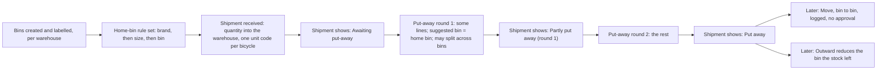
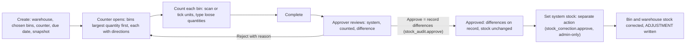
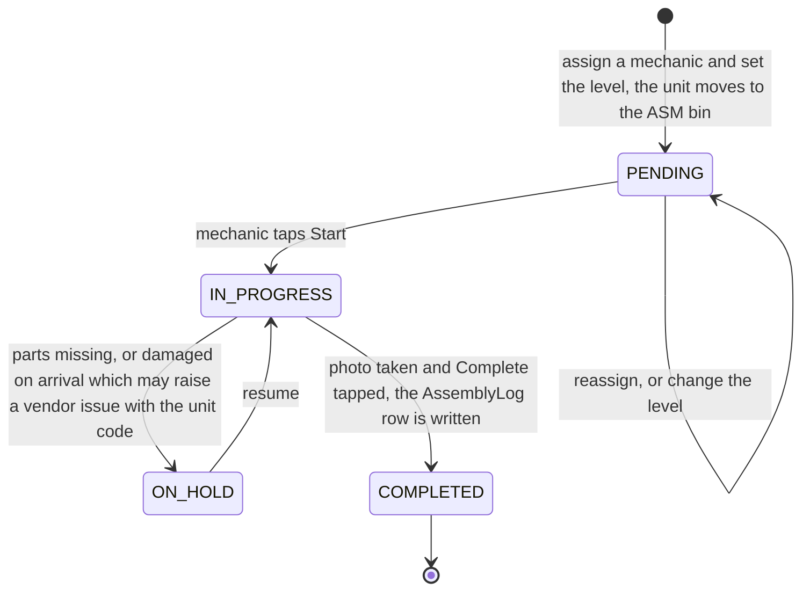
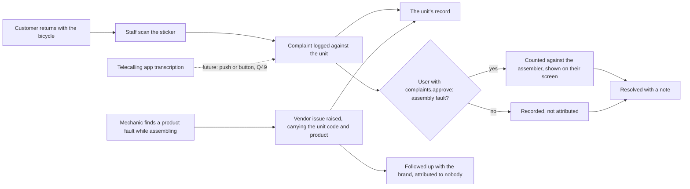

# Assembly audit — requirements, action flow and questions

Written 10 Sep 2026 from the owner's request. **Updated 11 Sep 2026 with the owner's answers** to the first round of questions, and every "Today:" fact re-verified against the code the same day. This is a **requirements document**, not an implementation plan. It has eight parts:

1. **The requirements** — the owner's words, verbatim, then each one restated in plain language.
2. **The action flow** — for each requirement, who does what, step by step, what the app must do at each step, and a worked business example.
3. **The questions** — the first round (Q1–Q44) with every answer recorded, and the second round (Q45–Q66): the doubts the answers raised and a review of this document found.
4. **The permission map** — which module and action unlocks which step. Data for the RBAC catalog, never code.
5. **Facts verified against the code** — file:line, so the implementation plan starts from the code as it is.
6. **Out of scope for now.**
7. **Work record** — what has been done on this requirement, in order; what is decided; what is waiting; what happens next.
8. **Overview at a glance** — the whole document on one page: the nine stages, the question count, the ten blocking questions, what is decided.

Where it helps, a line marked *Today:* says what the app already does, so the reader can see what is new. A step marked *(Owner, 11 Sep)* was settled by the owner's answer. Nothing here has been built.

---

## 1. The requirements

### 1.1 The owner's words, verbatim (10 Sep 2026)

> in this application i have an requirement where i need the aplication to have the assamble audit here to track things like as the inword happes the inworded item must be pased in the bin location respected to the warehosue bin location is nothing biut the section of storing the item where we can have the sections where the sectoions are called as the bin after the items get placed to the repected section of bins of the warehouse we need the same audit thing fro this assamle audit where the user with the permission must be able to create a aution for counting the items and another things is the mecanic were they are ntg but usere with role macanic where the macanic will be given the related module permission after the item get paced respect to bin do we need to have the item per bin ie section in the warehosue the user with the module permission of assinging the user for assambling the items will be assigned b to to the user where hw will be responsible for asaambling the items and i need to generate a unique sku or for the assembled items where that will be used as teh sku or some tracking where if some customer buy the itema and if we get any complanes we can manage the number of issues and the complain where making a complain on the item respedly must counted for the user who assambled thta so that we can tell the assembled user to take care of the issue where he shuld not repeayt it again and also need to track the state of assembling like pending progress and complted and in this the time span how many did he complete like also able to track the productivity

### 1.2 The owner's answers, verbatim (11 Sep 2026)

Given in `docs/answer.md`, in the owner's order, reproduced whole so nothing is lost in the restating. The numbered "1." and "2." at the top answer two questions put to the owner in conversation, about what happens at the store and about pulling items from the warehouse; the rest answer §3 in roughly the order the questions were asked.

> 1. We also do stock counting at the store, and we also do assembly at the store. We also have bin locations at the store.
> 2. Currently, we are not selling items from the warehouse, but in the future, we will also sell items from it. That is why I told you that we would also pull items from the warehouse.
>
> A complaint can come from a customer, logged by staff, or from the mechanic about the product quality. After the fourth step in the whole flow of the story, the mechanic also pastes the barcode on the cycle he pulls out from the warehouse. We will label the barcode on the cycle. This is a physical activity done while we are inverting the cycles, and the mechanic labels it on the cycle.
>
> Yes, a bin is part of a warehouse. The overall idea is that, let's say, if there is a warehouse layout with 10 different locations or corners, each corner is a bin number. I think we must be able to create n bin numbers inside one warehouse because we can have n corners, locations, or landmarks. Each landmark is a bin, and once a bin is created, we would label it physically inside the store so the person working on the floor understands what this bin is.
> Yes, it is for both quantities of everything, plus each unit has its own bin for anything carrying a code. Yes, we can do this. It should show:
> - Awaiting
> - Put away
> - Receive
> - First put away
> - Second put away
> It can be done this way because a bin is not specific to one brand, one type, or one color. It can be for anything and everything. Maybe I would want one particular brand or one particular model to be combined with another model and kept in some place. It should be up to the admin to assign the bin and make sure this particular item stays inside this bin.
> The entire flow also needs another step where the admin assigns the bin to the items. If you ask me whether we have to make a segregation, we would first categorize it by brand and then by size. This way, we can also generate custom reports inside our application. Let's say we have 20 motorcycles, and under those, we have:
> - 4 24-inch cycles
> - 5 20-inch cycles
> - 10 29-inch cycles
> This is how we can categorize them inside the bin. The flow is from the brand, so we need to assign each item to the bin. Otherwise, how will we even know which item is allocated to which bin?
> I think the admin decides who controls the creation, editing, and deletion of the bins. Yes, it will be a unique code per warehouse, and it will be a series of codes. Let it have no bin, and once we are doing the inwards, we will select the bin because that is the step where this bin is being considered.
> Yes, a move action with a log is fine. We don't need approval, but we need a move action with a log. When we are outwarding the item, I will make sure the bins are designed so that, let's say, if I say this is bin A1 and we keep this particular model, brand, and category here, we need to make sure this is followed. Once we make sure this is followed, it becomes easier.
> Related to the bin audit, I think maybe we can have it set up so we get to know which stock is lying under which bin. We can then maybe sort by the highest stock quantity first, go to that bin, and figure it out. The app should also tell us where this bin is inside the warehouse or the store. Let's say the bin is right inside the store, on your left-hand side, on the first rack, because the warehouse is designed in such a way that you can actually name it. Currently, there are 4 racks on the ground floor, and on the upper floor, we have 6 different lines. The app must be able to tell the counter the directions as well, and it will help him in the audit.
> We start from the bin with the largest number of items for the audit. Currently, I am going to use a barcode scanner, so he just scans or ticks anything, and it is okay. I think it should not allow the approver to record the difference or set the system stock count. It should only allow the admin to do this, and no one else.
>  and in this system everything si RBAC no static  persmision of user access all the permission will be under the role and that role will be attached to the user where  he user get the permission the suprivior or mecanic  this are role  where the admin will create them with the module related permission as needed in this requirement
>
>  Here, we need to do a mechanical assignment and state. Currently, we need to record the assembly state of each bicycle: 50%, 85%, or 100%. We need to know how many bicycles are assembled in each category. I think it will be the supervisor's responsibility while he is assigning these cycles. He selects the assembly condition of the product just once, so this becomes a one-time task for him.
>
> Let's say there are 10 bicycles, and he has to assign 6 of them. For these 6 cycles, the condition is item-level, so he mentions it. This makes it a very easy task for him.
>
> Yes, adding a hold item is required because of the missing parts, damaged-on-arrival, and similar reasons. The reason I kept it this way inside the service app (50%, 85%, 100%) was to record the assembly and services, but later I have understood that you know Assembly was a build-line process and not a part of the service app, so we didn't actually continue using it. Yes, the photo is required to complete an assembly, and yes, it must move automatically to the assembly area bin. Let it move automatically, because it is simply avoiding the additional click or effort.  Yes, let us have the suggested code.
>
> Again, I want to ask you: if we have the suggested code on the bicycle, would it help us with billing, given that we are using Zoho? There is already a number, and this is a serial number, not an SKU. The SKU is the product code, and the serial number is something we invent in our build line process or the assembly audit line process.
>
> I just want to clarify that these two are different numbers, and on the barcode, we have the SKU and the serial number together. When we are billing, we make sure to type the serial number because you can do that. Frame number will be recorded once we have received the stock and once we have put it away. It is not mandatory for all the brands, but for a few brands, let's make it mandatory. Currently, the customer complaint that goes into the app is via Telicarum. We have a Telicarum application that I will install on all the employees' devices. It will record the customer's audio and conversation, then push a transcription to the cloud. We use the transcription to understand how many complaints we are receiving, what is happening, and related details. Here, we also need to understand the complaint coming from the Mac. We have already discussed that, so it has to go to the vendor issues. What we'll do is this: while billing the cycle, we can type the serial code along with the billing number, or maybe we'll just insert it as a note on the sales invoice. We will pull the sales invoice in the outward, and we'll make sure we can pull this note or the serial number that we had written on the sales invoice. I don't know what the better way is. If you can, check with AI and tell me what the best possible way is. It will be better.
>
>
> Yes, let a supervisor count a log as an assembly fault, and only then will it be mentioned as an assembly fault.
>
> We do about 1,000 cycles a month, and the number of bins will be somewhere between 20 and 30. The number of mechanics will be 7 to 8, and the number of stores that will use this will be 3. Currently, we don't assemble e-bicycles in the BCC warehouse, so it will be 3. I would still say Q44: keep both.

### 1.3 The requirements, one by one

The ten requirements of 10 Sep, unchanged:

| # | Requirement in plain words |
|---|---|
| **R1** | A **bin** is a named section of a warehouse — a shelf, a rack, a floor area. Every warehouse has its own bins. |
| **R2** | When goods are received (the inward), each received item is **placed into a bin** of the warehouse it arrived at, and the app records which bin. |
| **R3** | A user with the right permission can **create a counting audit for a bin**, the same way a stock audit is created today: one person counts what is in the bin, another person approves. |
| **R4** | A **mechanic** is not a special kind of user. A mechanic is an ordinary user whose role has been given the assembly module's permissions. |
| **R5** | A user with the **assign** permission assigns an item (a bicycle) to a mechanic. That mechanic is responsible for assembling it. |
| **R6** | Every assembled item gets a **unique code** (the owner called it "a unique SKU"). That code identifies that one bicycle from then on. |
| **R7** | If a customer buys that bicycle and later **complains**, the complaint is recorded against the bicycle's code and **counted against the mechanic who assembled it**, so the mechanic can be told and does not repeat the fault. |
| **R8** | The **state** of each assembly is tracked: pending, in progress, completed. |
| **R9** | **Productivity** is visible: for any span of time, how many bicycles each mechanic completed and how long they took. |
| **R10** | The owner's own open question: "do we need to have the item per bin?" — should the app know *which individual items* sit in a bin, or only *how many*. See Q2. |

Fourteen more, added 11 Sep from the answers. Each cites the answer it comes from:

| # | Requirement in plain words | From the owner's answer |
|---|---|---|
| **R11** | Bins exist in **every** warehouse, the shop floor included. Stock counting, assembly and bin locations happen in the store's floor warehouse **too**, not only in the godown. | "We also do stock counting at the store, and we also do assembly at the store. We also have bin locations at the store." |
| **R12** | Bicycles are built in **both** the godown and the shop floor (warehouses with `FLOOR` and `GODOWN` tags). Whenever stock leaves any warehouse, the bin it left must be reduced. Moving a bicycle between Godown and Store Floor is performed via **Stock Transfer** that carries unit codes (Move is strictly intra-warehouse). Selling from the godown is a future path. | "Currently, we are not selling items from the warehouse... would also pull items from the warehouse." *(Settled 11 Sep, Q57)* Built in both Floor and Godown; Godown ↔ Floor movement is a Stock Transfer. |
| **R13** | The **admin assigns items a home bin** — grouped by brand first, then by category (there is no size field; category already holds the wheel size / model type). Put-away follows the home bin. Reports count what is in each bin by brand and category. | "…another step where the admin assigns the bin to the items… categorize it by brand and then by size…" *(Settled 11 Sep, Q47)* Grouped by brand and category only; no size field. |
| **R14** | Put-away happens **after** receipt, in **rounds**. The shipment shows: Received → Awaiting put-away → Partly put away (round 1, round 2 …) → Put away. | "It should show: Awaiting, Put away, Receive, First put away, Second put away." **Open: Q60 — whether a transfer receipt also goes through put-away rounds.** |
| **R15** | The app **tells the counter where a bin is** (directions, floor, rack) and orders the bins of an audit by quantity, largest first. | "…sort by the highest stock quantity first… The app should also tell us where this bin is… on your left-hand side, on the first rack… 4 racks on the ground floor, and on the upper floor, we have 6 different lines." |
| **R16** | The audit **approver records differences or rejects** (`stock_audit.approve`). **Setting system stock is a separate action** (`stock_correction.apply`) governed by RBAC permissions across all audits (bin audit, warehouse audit, brand count). Similarly, returns, damages, and loss write-offs are governed by granular module permissions (`inventory.adjust_loss`, `inventory.process_return`). Admin role bypasses; no non-admin roles are hardcoded in code. | "It should not allow the approver to record the difference or set the system stock count..." *(Settled 11 Sep, Q62, Q64)* Granular module permissions govern stock correction and loss write-offs. Admin bypasses all checks. |
| **R17** | The supervisor sets the **assembly level** (50 %, 85 %, 100 %) **once, at assignment, per bicycle**. Reports count completed bicycles per level. | "…the supervisor's responsibility while he is assigning these cycles. He selects the assembly condition of the product just once… the condition is item-level." |
| **R18** | Assigning a bicycle **moves it to the warehouse's assembly bin automatically**, with a log. | "…it must move automatically to the assembly area bin. Let it move automatically, because it is simply avoiding the additional click or effort." |
| **R19** | One label carries the **SKU and the unit code together**. Codes are **minted at receipt**; the **mechanic pastes** the label on the frame during assembly. | "…the mechanic also pastes the barcode on the cycle he pulls out from the warehouse… on the barcode, we have the SKU and the serial number together." |
| **R20** | The **frame number** is recorded at receipt or put-away. It is **mandatory for brands the admin flags**, optional for the rest. | "Frame number will be recorded once we have received the stock and once we have put it away. It is not mandatory for all the brands, but for a few brands, let's make it mandatory." |
| **R21** | Complaints come from **three sources**: a customer (logged by staff), a mechanic about product quality (a **vendor issue** carrying the unit code), and the telecalling app's transcriptions (external today). | "A complaint can come from a customer, logged by staff, or from the mechanic about the product quality… Telicarum… push a transcription to the cloud… the complaint coming from the Mac… has to go to the vendor issues." |
| **R22** | The **sales invoice carries the unit code(s)**, so the pulled invoice links each bicycle to its customer. | "…while billing the cycle, we can type the serial code along with the billing number, or maybe we'll just insert it as a note on the sales invoice. We will pull the sales invoice in the outward…" |
| **R23** | **Everything is RBAC.** No fixed roles in code. Supervisor and Mechanic are roles the admin creates on `/team/permissions` with the module permissions this document names. | "…in this system everything is RBAC, no static permission of user access, all the permission will be under the role and that role will be attached to the user… the supervisor or mechanic, these are roles where the admin will create them with the module related permission…" |
| **R24** | Volumes: about 1,000 bicycles a month, 20–30 bins, 7–8 mechanics, 3 stores. No e-bicycle assembly at the BCC warehouse. The warehouse-level stock audit stays beside the bin audit. | "We do about 1,000 cycles a month, and the number of bins will be somewhere between 20 and 30. The number of mechanics will be 7 to 8, and the number of stores that will use this will be 3… Q44: keep both." |

R10, the owner's own doubt ("do we need to have the item per bin?"), is now answered by Q2: **both** — quantities for everything, plus each unit's own bin for anything carrying a code.

### 1.4 Words used in this document

| Word | Meaning |
|---|---|
| **Store** | A shop with a door. Stock does not live on the store; it lives in the store's warehouses. When the owner says "at the store" (R11), the store's **floor** warehouse is meant. |
| **Warehouse** | A floor (the shop floor, where customers see bicycles) or a godown (the back store). A store can have several. Both kinds have bins. |
| **Bin** | A named, physically labelled landmark inside one warehouse: a rack, a shelf, a floor area, a corner. Its code is unique within its warehouse and is shown with the warehouse, for example `GODOWN-A1`. |
| **Directions** | The bin's plain-language location, shown to the counter during an audit: "Ground floor, left of the entrance, first rack." |
| **Home bin** | The bin the admin has assigned to a group of items (a brand, then a size). Put-away suggests it; a different bin is allowed with a warning. |
| **Assembly bin** | The one bin per warehouse flagged as the assembly area. A bicycle moves there automatically when it is assigned to a mechanic. |
| **Put-away** | Telling the app which bin the received goods were placed in. Happens after receipt, in one or more **rounds**. |
| **Put-away round** | One session of put-away for a shipment. A shipment is *Partly put away* between rounds and *Put away* when every line has a bin. |
| **Move** | Changing the bin of a unit or a quantity inside the same warehouse. Logged, never approved. |
| **Unit** | One physical bicycle carrying its own code on a sticker. |
| **Unit code** | The unique code on that sticker, for example `U-000481`. One company-wide series. This is *not* the product SKU — in this app a SKU is the model ("Hero Sprint 29", stock 12), not one bicycle. |
| **Unit label** | The sticker: the product SKU as text and the unit code as a barcode, printed at receipt, pasted on the frame at assembly. |
| **Frame number** | The manufacturer's number stamped on the frame. Recorded at receipt or put-away; mandatory for flagged brands. |
| **Assembly task** | The job of building one unit, given to one mechanic, at one level (50 %, 85 %, 100 %), with a state. |
| **Level** | How much building the bicycle needs: 50 %, 85 % or 100 %. Set once by the supervisor at assignment. |
| **Mechanic** | Any active user whose role holds the assembly **edit** permission. Never a role name. |
| **Supervisor** | Whoever holds the assembly **approve** permission (and, for audits, the stock audit **approve** permission). Never a role name. |
| **Admin** | The system role that holds every permission, including the one that sets system stock. |
| **Bin audit** | A stock audit for a chosen set of bins in one warehouse. |
| **Complaint** | A customer's problem with one unit, logged by staff against the unit code. |
| **Vendor issue** | An existing record for a problem with what a vendor supplied. A mechanic's product-quality complaint becomes one, carrying the unit code. |

### 1.5 Principles that bind every section

1. **Access control is data.** Every step below names a permission (`module.action`), never a role. Supervisor and Mechanic are roles the admin creates on `/team/permissions` and can rename, split or merge without a deploy (R23). A rule written as `role === "SUPERVISOR"` is a bug even if the build passes.
2. **The API is the gate.** A hidden button is cosmetic; every route re-checks the permission per request.
3. **No cron, no timers, no polling.** Anything periodic is a button behind a permission. "Stuck for more than a day" is computed when the screen loads.
4. **Times are IST.** Day boundaries use the existing IST helper, not server time.
5. **Public routes stay public.** Nothing here adds a permission check to `/review/[token]`, `/fill/[token]`, `/api/public/*`, `/api/auth/*`, `/api/my-permissions` or `/api/services/earn-sync`.
6. **Schema changes go through Prisma Migrate**, additive first, and nothing runs against production from a laptop.

---

## 2. The action flow

### 2.1 The whole flow as a story

The cast: **Priya** receives goods (`inbound.edit`). **Meena** supervises the workshop and the audits (`assembly.approve`, `stock_audit.create`, `stock_audit.approve`, `complaints.approve`). **Ravi** and **Suresh** are mechanics (`assembly.view`, `assembly.edit`). **Arun** is a junior at the counter (`stock_audit.edit`, `complaints.create`). **The admin** holds everything, including `stock_correction.approve`. Bins in the main store's godown: floor areas `A1`–`A6`, shelves `S01`–`S12`, and the assembly area `ASM`. The admin has set home bins: Hero 24-inch and 20-inch → `GODOWN-A1`, Hero 29-inch → `GODOWN-A2`, tubes → `GODOWN-S07`. Hero is flagged "frame number required".

1. **11 Sep 2026, 10:30 — the truck.** Twenty boxed, half-built Hero bicycles arrive at the godown: 4 × 24-inch, 6 × 20-inch, 10 × 29-inch, plus 50 tubes. Priya counts them against the bill and marks the shipment **received**. The app adds the quantities to the godown *(Today: exists)*, mints twenty unit codes `U-000481`…`U-000500`, and prints twenty labels, each showing the SKU and the unit code. The labels stay with the cartons. The shipment now shows **Awaiting put-away**. *(New: codes, labels, the status.)*
2. **Same day, 12:00 — put-away, round 1.** Priya opens the shipment, ticks the ten 29-inch cartons; the app suggests `GODOWN-A2` from the home-bin rule. She scans each carton's label and keys its frame number, because Hero is flagged. She puts the 50 tubes on `GODOWN-S07`. The shipment shows **Partly put away (round 1)**. At 16:00, round 2: the remaining ten go into `GODOWN-A1`, one of them via `GODOWN-A3` with a warning and a logged Move back (§2.2): **Put away**. The by-bin report now reads A1: Hero 24-inch 4, Hero 20-inch 6 · A2: Hero 29-inch 10 · S07: tubes 50. *(New.)*
3. **12 Sep, 09:10 — assignment.** Meena opens the assembly board, sees twenty pending units, and assigns ten to Ravi and ten to Suresh, choosing a level for each bicycle as she goes. The app moves all twenty from `GODOWN-A1`/`A2` to `GODOWN-ASM` and logs "moved by assignment, Meena, 09:12". Ravi's phone lists his ten. *(New.)*
4. **12 Sep, 09:20 — the build.** Ravi pulls `U-000481` out of the godown, unboxes it, inverts it, and pastes its label on the down tube. He taps **Start**. At 09:35 a pedal is missing: **On hold**, "parts missing". At 10:05 he resumes; at 10:31 he takes the photo and taps **Complete**. Build time recorded: 41 minutes, hold excluded. The app records Ravi as the assembler of `U-000481`, writes the row the external earnings feed already reads, and asks where the finished bicycle goes (Q46). *(New; the workshop's tap-a-button tally is retired.)*
5. **20 Sep — the sale.** At the counter, Mr Kumar buys `U-000481`. The invoice `INV-2026-0912` is raised in Zakya; the biller types `U-000481` into the invoice's **Unit codes** field. On 21 Sep the Bulk Fetch pulls the invoice, resolves the code to "Hero Sprint 29, assembled by Ravi, 12 Sep", and marks the unit **sold**. At handover the delivery staff scans the sticker; it matches the invoice. The bin the bicycle left is reduced automatically. *(New; today the app never knows which bicycle went to whom.)*
6. **25 Sep — the bin audit.** Meena creates a bin audit for `GODOWN-S07`, `GODOWN-ASM`, `GODOWN-A1` and `GODOWN-A2`, assigned to Arun. The screen lists S07 first (50 tubes), then ASM (6 units still unbuilt, by code), then A1 and A2 (0 expected), each with its directions: "S07 — upstairs, line 2, third shelf". Arun counts 48 tubes and scans 5 of the 6 units in ASM: `U-000497` is missing. Meena reviews and **approves**: the differences are recorded, stock is unchanged, and the screen offers her no way to set stock. The next day the admin opens the same audit and **sets system stock**; the adjustment and who made it are logged. *(New — copied from the stock audit that exists today, with the admin-only correction.)*
7. **4 Oct — the complaint.** Mr Kumar returns: the brakes rub. Arun scans the sticker; the app shows the unit, its sale, and Ravi as the assembler. Arun logs the complaint with a photo. Meena marks it an **assembly fault**; Ravi's screen shows one complaint. The same week Suresh finds a cracked rim on `U-000495` while assembling and raises a **vendor issue** against Hero carrying the unit code; it counts against nobody. *(New.)*
8. **6 Oct — the month-end review.** The owner opens the productivity screen for September. Ravi: 62 completed (12 at 50 %, 30 at 85 %, 20 at 100 %), average 41 minutes, 1 complaint, because Mr Kumar's complaint sits on a bicycle Ravi completed in September. Suresh: 58 completed, average 55 minutes, 0 complaints. Ravi sees only his own numbers. *(New.)*

### 2.2 Flow for R1, R2, R11, R13 and R14 — bins, home bins, receiving and put-away rounds

A bin is a labelled landmark inside **one** warehouse: a rack on the shop floor, a floor area or a shelf in the godown. The floor warehouse has bins exactly as the godown does, because counting, assembly and bin locations all happen at the store too (R11). A warehouse has as many bins as it has landmarks, and each one is labelled physically so the person on the floor knows what it is. The admin gives products a **home bin**, grouped by brand first and then by size (R13). Goods are **received first and put away afterwards**, in rounds, and the shipment shows how far the put-away has got (R14).

| Step | Who | What they do | What the app must do |
|---|---|---|---|
| 1 | User with `bins.create` (the admin decides who holds it, Q5) | Creates the bins of each warehouse once: a code, a name, a **directions** text ("Ground floor, left of the entrance, first rack."), the floor or zone, an optional capacity. Prints a bin label and sticks it on the landmark. *(Owner, 11 Sep)* | Keep bins **per warehouse**, for the floor warehouse and the godown alike (R11). The code is unique **within the warehouse** and is a series (`A1` … `A6`, `S01` … `S12`, `ASM`); the same code may exist in another warehouse; show it as `GODOWN-A1` (Q6). Store the directions text and the floor (R15). Capacity stays optional (round-2 Q55). A printable, scannable label per bin is round-2 Q56. **Today:** `Bin` has `code @unique` company-wide, `name`, a free-text `location`, `zone?`, `capacity?`, `isActive`; **no warehouse FK and no directions field** (`prisma/schema.prisma:654-672`). The bins screen is `/more/bins`, gated on `settings.*` (`src/app/(dashboard)/more/bins/page.tsx:29-30`; `src/app/api/bins/route.ts:11,26`); PATCH edits only name, location and zone, and DELETE is a soft delete refused while products or serials point at the bin (`src/app/api/bins/[id]/route.ts:10,18-20,32,42-50`). |
| 2 | User with `bins.edit` (the admin) | Sets the **home-bin rule** of a warehouse: for a brand, then for each size under that brand, chooses the bin (Hero 24-inch and Hero 20-inch to `GODOWN-A1`, Hero 29-inch to `GODOWN-A2`); for loose items, per product (tubes to `GODOWN-S07`). *(Owner, 11 Sep)* | Store the rule as data per warehouse: brand → size → bin, and product → bin for items with no size. A bin is not tied to one brand: "It should be up to the admin to assign the bin and make sure this particular item stays inside this bin." Use the rule as the **suggested bin** at put-away (step 6) and as the bin an outward reduces (step 9, Q9). Show a "no home bin yet" list. **Today:** nothing of the kind. `Product.binId` is one default bin per product, with no brand or size grouping (`prisma/schema.prisma:517-585`), and `Product.size` is annotated "dropped next release" (`prisma/schema.prisma:546`). The brand → size rule needs a size attribute, so see round-2 Q47 (Part C). **Open: Q47 — the rule becomes brand, then category (no size field comes back), with a model allowed its own bin, pending the owner's confirmation.** |
| 3 | User with `inbound.edit` (Priya, the inwards executive) | Marks each line of the shipment received into a warehouse, as today. | Add the quantity to that warehouse's stock. No bin is asked for here (Q3). **Today:** exists. `PATCH /api/inbound/[id]` behind `inbound.edit` (`src/app/api/inbound/[id]/route.ts:70`) records the delivered quantity of a line into a warehouse (`:141,177,347`) and moves the shipment through `PARTIALLY_DELIVERED` to `DELIVERED` (`:136-147,311-326`). |
| 4 | App | For every bicycle received, creates one **unit** with its own code and prints its label: SKU and unit code on one sticker (§2.6). | Mint `U-000481` … `U-000500` from one company-wide counter, so 20 codes minted at once never collide (Q23, Q24). The sticker is pasted on the frame **at assembly**, not here (R19, §2.6, round-2 Q45). **Today:** `SerialItem` has `serialCode @unique`, `binId`, `status`, `soldAt`, `saleInvoiceNo` (`prisma/schema.prisma:607-640`) but **no row is ever created**; the only writer is an update at outward (`src/app/api/inventory/outwards/route.ts:124-136`). `nextSequence()` is a single upsert and race-safe (`src/lib/sequence.ts:89-124`). **Open: Q58 — 'every bicycle' is undefined, and nobody pastes the sticker on a coded bicycle that has no task.** |
| 5 | App | Shows the shipment's put-away progress beside its receipt status. The owner's words: "It should show: Awaiting, Put away, Receive, First put away, Second put away." *(Owner, 11 Sep)* | The ladder (R14): **Received** → **Awaiting put-away** → **Partly put away (round 1)** → **Partly put away (round 2)** … → **Put away**. Computed from the lines: a line is done when its put-away quantity equals its received quantity, or it was marked "no bin" on purpose (Q7); the shipment is Put away when every line is done. Each round is numbered and kept: who, when, which lines, which bins. **Today:** no such status. `InboundShipmentStatus` has exactly `IN_TRANSIT, DELIVERED, PARTIALLY_DELIVERED` (`prisma/schema.prisma:1910-1914`), and put-away is three nullable columns `putawayAt / putawayById / putawayBy`, set once (`prisma/schema.prisma:1944-1946`). |
| 6 | User with `inbound.edit` (Priya) | Opens a received shipment and puts away the lines she is shelving **now**, leaving the rest for a later round. For anything carrying a code: scans the unit, then the bin, one bin **per unit**. For loose items: a quantity per bin, **split** across bins allowed. The suggested bin is the home bin; she may choose another; she may leave a line as "no bin". *(Owner, 11 Sep)* | Record **unit → bin** and **quantity → bin** per round, with who and when. Suggest the home bin (R13); **warn** when a different bin is chosen, then allow it. Allow "no bin" (Q7). Keep a quantity per product per bin (Q2). Reduce the line's remaining quantity and move the status up the ladder (step 5). Round 2 (and 3 …) is the same screen on the same shipment (Q4). **Today:** the put-away route exists behind a compile-time flag, `BIN_TRACKING_ENABLED = false` (`src/lib/inventory-config.ts:10`); it is gated on `inbound.approve`, not `inbound.edit` (`src/app/api/inbound/[id]/putaway/route.ts:14`); it takes **one bin per line with no quantity** (`:17`) and **overwrites `Product.binId`** with no transaction or log (`:34-45`); the UI collects a bin per unit but sends only the first (`src/app/(dashboard)/inbound/[id]/page.tsx:417,518-537,789-803`). There is no per-bin quantity table: `StockLevel` is `@@unique([productId, warehouseId])` (`prisma/schema.prisma:590-605`). |
| 7 | User with `inbound.edit` | Moves a unit, or a quantity of a loose item, from one bin to another bin of the **same** warehouse. No approval. *(Owner, 11 Sep)* | Write a log line: who, what (unit code, or product and quantity), from bin, to bin, when, optional reason. Refuse a move between warehouses; that is a transfer. Warn, then allow, when the target is not the home bin (Q8). **Today:** no move action exists. |
| 8 | User with `bins.view`; anyone with the scanner | Opens a bin on the screen, or scans a unit label, or types a code. | For a bin: what is in it by brand, size and count, and the unit codes under each. For a unit: its product, bin, state and history. **Today:** `/scanner` calls `GET /api/serials/search`, which resolves serial codes and SKUs (`src/app/(dashboard)/scanner/page.tsx:57`; `src/app/api/serials/search/route.ts:19-52`) and finds nothing on the unit side, because no unit row exists (step 4). |
| 9 | User with `deliveries.create` (the outwards executive) | Sends stock out: a sale or a transfer. | Reduce the bin the stock left. A **unit**: the bin it sits in, automatic. A **loose item**: the home bin, automatic, when the product sits in one bin; **ask** which bin when it sits in more than one (Q9). Today sales happen from the floor warehouse; selling from the godown is a future path (R12, §2.9). When stock moves from the godown to the shop floor, it goes via a **Stock Transfer** that carries the unit codes (settled Q57, Q60). The mechanic's assembly pull inside the same warehouse is an automatic Move to that warehouse's assembly bin (R18, §2.5). **Today:** the outwards route is gated on `deliveries.create` (`src/app/api/inventory/outwards/route.ts:56`) and marks units sold by serial code (`:124-136`), but there is no bin quantity to reduce. **Settled: Q57 & Q60 — Godown ↔ Floor movement is a Stock Transfer carrying unit codes; intra-warehouse movements are Moves. Open: Q61 — whether the bin is reduced at invoice import or at handover and walk-out.** |
| 10 | User with `bins.view` | Opens "what is in each bin". *(Owner, 11 Sep)* | Per warehouse, per bin: **brand → size → count**, with the unit codes under each line. The owner's example: "4 24-inch cycles, 5 20-inch cycles, 10 29-inch cycles" (R13). A "not in any bin" list for stock that has no bin (Q7). Export to Excel like the other reports. **Today:** nothing; there is no per-bin quantity to report (`prisma/schema.prisma:590-605`). **Open: Q65 — whether second-hand cycles appear in bins and in the by-bin report.** |

**Example**

1. **1 Sep 2026.** The admin, holding `bins.create`, creates the godown's bins: `GODOWN-A1` … `GODOWN-A6` (floor areas), `GODOWN-S01` … `GODOWN-S12` (shelves) and `GODOWN-ASM` (the assembly area). `GODOWN-A1` gets the directions "Ground floor, left of the entrance, first rack." Each bin label is printed and stuck on the landmark. The floor warehouse gets `FLOOR-R1` … `FLOOR-R4` (the ground-floor racks) and `FLOOR-L1` … `FLOOR-L6` (the lines upstairs).
2. **Same day.** With `bins.edit`, the admin sets the home-bin rule for the godown: Hero 24-inch → `GODOWN-A1`; Hero 20-inch → `GODOWN-A1`; Hero 29-inch → `GODOWN-A2`; tubes → `GODOWN-S07`.
3. **11 Sep 2026, 10:30.** A shipment of 20 Hero bicycles (4 × 24-inch, 6 × 20-inch, 10 × 29-inch) and 50 tubes arrives at the godown, boxed and half-built. Priya (`inbound.edit`) marks every line received. The godown's stock rises by 20 bicycles and 50 tubes. The app mints `U-000481` … `U-000490` (29-inch), `U-000491` … `U-000494` (24-inch) and `U-000495` … `U-000500` (20-inch) and prints 20 labels; the labels stay with the boxes until assembly (§2.6). The shipment shows **Received · Awaiting put-away**.
4. **11 Sep, 12:00, round 1.** Priya opens the shipment and puts away what she can before lunch: she scans each of the ten 29-inch units (`U-000481` … `U-000490`) and then `GODOWN-A2` (the suggested bin), keys each frame number, and types 50 tubes into `GODOWN-S07`. The shipment shows **Partly put away (round 1)**: 2 lines done, 2 lines with 10 bicycles still to place.
5. **11 Sep, 16:00, round 2.** Priya scans `U-000491` … `U-000494` (24-inch) into `GODOWN-A1` and `U-000495` … `U-000499` (20-inch) into `GODOWN-A1`, keying the frame numbers as she goes. `GODOWN-A1` is full, so she scans `U-000500` into `GODOWN-A3`. The app warns: "The home bin for Hero 20-inch is GODOWN-A1. Put U-000500 in GODOWN-A3 anyway?" She confirms. The shipment shows **Put away**.
6. The "by bin" report for the godown now reads:

| Bin | Brand | Size | Count | Units |
|---|---|---|---|---|
| GODOWN-A1 | Hero | 24-inch | 4 | U-000491 … U-000494 |
| GODOWN-A1 | Hero | 20-inch | 5 | U-000495 … U-000499 |
| GODOWN-A2 | Hero | 29-inch | 10 | U-000481 … U-000490 |
| GODOWN-A3 | Hero | 20-inch | 1 | U-000500 (not its home bin) |
| GODOWN-S07 | (tube product) | (none) | 50 | loose, no codes |

7. **11 Sep, 17:30, a Move.** Space opens in `GODOWN-A1`. Priya (`inbound.edit`) uses **Move**: `U-000500` from `GODOWN-A3` to `GODOWN-A1`. No approval. The log reads "11 Sep 2026 17:32 · Priya · U-000500 (Hero 20-inch) · GODOWN-A3 → GODOWN-A1". `GODOWN-A3` is empty again and `GODOWN-A1` now shows 6 Hero 20-inch.
8. **12 Sep, 09:10.** Meena (`assembly.approve`) assigns all 20 bicycles to Ravi and Suresh, and the app moves each unit from `GODOWN-A1` / `GODOWN-A2` to `GODOWN-ASM`, one log line per unit (R18, §2.5). From here the report shows the bicycles under `GODOWN-ASM` until each is built. The 50 tubes stay in `GODOWN-S07`. This is the position the bin audit of 25 Sep starts from (§2.3).

### 2.3 Flow for R3, R15 and R16 — the bin audit

The bin audit is today's stock audit, copied, and run per bin. When the counter opens it, the app lists the audit's bins with the largest system quantity first and tells the counter where each bin is: the directions text and the floor (R15). The counter scans each unit with the barcode scanner or ticks it, and types the quantity of loose items. The approver **approves**, which records the differences, or **rejects**. Setting the system stock to the counted figures is a separate action behind a separate grant, `stock_correction.approve`, that only the admin role can hold (R16).

| Step | Who | What they do | What the app must do |
|---|---|---|---|
| 1 | User with `stock_audit.create` (Meena) | Creates a bin audit: picks **one** warehouse, ticks one or more of its bins, names a counter who is not herself, sets a due date (Q10). | Freeze a snapshot: for each chosen bin, every product's system quantity in that bin and the unit codes in it. Refuse assigning to yourself. **Today:** `POST /api/stock-counts` behind `stock_audit.create` refuses a missing counter and a self-assignment (`src/app/api/stock-counts/route.ts:90,95,97`), stores the counter and due date and freezes `systemQty` per line (`:207,211,219`). The scope is a warehouse or a whole store; its bin filter reads `Product.binId`, the single default bin, not a bin quantity (`:219-222`). |
| 2 | App | Orders the audit for the counter. *(Owner, 11 Sep)* | List the bins by system quantity, **largest first**; under each bin, its **directions** text and floor, then its lines (R15). "We start from the bin with the largest number of items for the audit." A bin with 0 expected is still listed, so the counter confirms it is empty. **Today:** `Bin` has no directions field, only `location` and `zone` (`prisma/schema.prisma:654-672`). |
| 3 | The counter, user with `stock_audit.edit` (Arun) | Goes bin by bin from the top. Scans each unit with the barcode scanner, or ticks it present; types the number for loose items (Q11). *(Owner, 11 Sep)* | Only the counter may count, only while the audit is in progress. A scanned unit that the snapshot placed in another bin is recorded as found here. A unit not scanned by the end is **missing**, with its code. **Today:** counts are written only by the assignee and only while `IN_PROGRESS` (`src/app/api/stock-counts/[id]/route.ts:131,149,158-183`); `/scanner` resolves serial codes and SKUs (`src/app/(dashboard)/scanner/page.tsx:57`; `src/app/api/serials/search/route.ts:19-52`). |
| 4 | The counter | Marks the audit complete. | Refuse while any line is uncounted; the "Record 0 for all uncounted" button stays. **Today:** exists (`src/app/(dashboard)/stock-audit/[id]/page.tsx:113,374-405,683`, calling `/api/stock-counts/[id]/zero-uncounted`). |
| 5 | User with `stock_audit.approve`, not the counter (Meena) | Reviews system / counted / difference per bin and line. **Approves** (= records the differences) or **rejects** with a reason. *(Owner, 11 Sep)* | Approving never changes stock. The screen offers the approver **no** "set system stock" action; the differences stay on the audit for reference (R16, Q12). Rejecting sends the audit back to the counter. **Today (this is what Q12 changes):** the same `stock_audit.approve` holder gets two modes, verify and apply (`src/app/api/stock-counts/[id]/route.ts:168-183,209-212`), labelled "Record the differences only" and "Set system stock to the counts" on the review screen (`src/app/(dashboard)/stock-audit/[id]/review/page.tsx:363-384`). The counter cannot approve their own audit (`src/app/api/stock-counts/[id]/route.ts:168-183`); that rule stays. **Open: Q64 — the same review screen serves the warehouse audit and the Brand Count, which Q44 kept as they are.** |
| 6 | User with `stock_correction.approve` (the admin; the module is `assignable: false`, so only the system role can hold it) | Opens an **approved** audit and sets the system stock to the counted figures. *(Owner, 11 Sep)* | A separate action, after approval, behind a separate permission (R16). For each changed line: set the **bin quantity** and the **warehouse total**, reading the live quantity at that moment; write an `ADJUSTMENT` transaction; mark a missing unit as missing and take it out of its bin. Log who corrected and when. The grant is the gate, never a role name (R23). **Today:** the apply path reads live quantity inside the transaction and writes `ADJUSTMENT` rows (`src/app/api/stock-counts/[id]/route.ts:233-275,332-449`); admin-only modules exist through `Module.assignable = false` (`prisma/schema.prisma:33-37`), already used by `brand_ledger` (`prisma/rbac-catalog.ts:480`); the correction sets the warehouse quantity only, as there is no bin quantity. **Open: Q62 — there is no path yet for a missing unit that turns up, or for returns, damage back to the brand, short deliveries or theft between audits.** |
| 7 | App | Keeps the record. | Who created, who counted, who approved or rejected, who set system stock, when, and what changed per line. **Today:** exists at warehouse level (`src/app/api/stock-counts/[id]/route.ts:332-449`). |
| 8 | App | Decides who sees which audits (Q13). | `stock_audit.approve` sees every audit; everyone else only their own. **Today:** exists. `GET /api/stock-counts` widens the query for `userCan(user.id, "stock_audit", "approve")`, a permission check, not a role name (`src/app/api/stock-counts/route.ts:33-38`). |

**Example**

1. **25 Sep 2026, 09:00.** Meena (`stock_audit.create`) creates "Godown bin audit, Sep 2026" for the godown, ticking `GODOWN-S07`, `GODOWN-ASM`, `GODOWN-A1` and `GODOWN-A2`, assigned to Arun, due the same day. The snapshot: S07 50 tubes; ASM 6 unbuilt bicycles, `U-000495` … `U-000500` (the other 14 were built and moved on, §2.5); A1 0; A2 0.
2. **09:10.** Arun (`stock_audit.edit`) opens the audit on his phone. The screen lists, in this order: **GODOWN-S07** (50) "Upstairs, line 2, third shelf from the stairs."; **GODOWN-ASM** (6) "Ground floor, the open area behind the roller door."; **GODOWN-A1** (0) "Ground floor, left of the entrance, first rack."; **GODOWN-A2** (0) "Ground floor, left of the entrance, second rack."
3. **09:15, S07.** Arun counts the tubes and types **48**. Difference −2.
4. **09:30, ASM.** Arun scans `U-000495`, `U-000496`, `U-000498`, `U-000499` and `U-000500` with the barcode scanner: five ticks. `U-000497` is not there; the app lists it as **missing**.
5. **09:40, A1 and A2.** Both empty, as expected. Arun taps "0 ✓" on each line and marks the audit **complete**.
6. **11:00.** Meena (`stock_audit.approve`, not the counter) opens the review: S07 system 50, counted 48, difference −2; ASM system 6, counted 5, `U-000497` missing; A1 and A2 no difference. She **approves**. The differences are on record and stock is unchanged: S07 still says 50 and `U-000497` still sits in `GODOWN-ASM` on the system. The screen shows her no "set system stock" action, because she does not hold `stock_correction.approve`.
7. **26 Sep, 08:30.** The admin (`stock_correction.approve`) opens the same audit and chooses **Set system stock**. The app sets the tubes in `GODOWN-S07` to 48 and the godown's tube total down by 2, writes an `ADJUSTMENT` transaction ("Shortage of 2, snapshot 50, live 50, counted 48, GODOWN-S07, during 'Godown bin audit, Sep 2026'"), marks `U-000497` missing, takes it out of `GODOWN-ASM`, and writes a second `ADJUSTMENT` for that product's godown total.
8. The audit's log reads: created by Meena, 25 Sep 09:00 · counted by Arun, 25 Sep 09:10 to 09:40 · approved by Meena, 25 Sep 11:00 · system stock set by the admin, 26 Sep 08:30.

### 2.4 Flow for R4 and R23 — who is a mechanic; everything is RBAC

The owner's rule for the whole system, 11 Sep, verbatim:

> and in this system everything si RBAC no static persmision of user access all the permission will be under the role and that role will be attached to the user where he user get the permission the suprivior or mecanic this are role where the admin will create them with the module related permission as needed in this requirement

In plain words. A **mechanic** is any active user whose role holds `assembly.edit`. A **supervisor** is whoever holds `assembly.approve` (and, for audits, `stock_audit.approve`). "Mechanic" and "Workshop supervisor" are roles the admin creates on `/team/permissions` with the grants listed in §4. No rule in this document, and no rule in the code built from it, is written as a role name. The admin can rename a role, split it in two, or add a third, and nothing in the code changes.

| Step | Who | What they do | What the app must do |
|---|---|---|---|
| 1 | User with `roles.create` and `roles.edit` (the admin) | On `/team/permissions`, creates a role, for example "Mechanic", and ticks the assembly module's **view** and **edit**; creates another, for example "Workshop supervisor", and ticks assembly **approve** *(Owner, 11 Sep)* | Show the new modules (`assembly`, `complaints`, `stock_correction`, `bins`) in the permissions editor as soon as they are seeded. Refuse to grant a module marked `assignable: false` to any role except the system role. *Today: exists for every module. The editor is read-only without `roles.edit` (`src/app/(dashboard)/team/permissions/page.tsx:61`). The role-write route refuses an admin-only grant by the role's `isSystem` column, never by its name (`src/app/api/roles/[id]/route.ts:74-80`). `requireFeature(module, action)` takes exactly two arguments; there is no role allow-list and no admin short-circuit (`src/lib/auth-helpers.ts:137-148`). `Module.assignable=false` is what makes a module admin-only (`prisma/schema.prisma:33-37`); `brand_ledger` already uses it (`prisma/rbac-catalog.ts:480`).* |
| 2 | User with `team.create` (the admin) | On `/team`, creates the user, gives them the role, and optionally attaches them to a store | Store the role on the user. One user holds one role. *Today: exists (`src/app/api/users/route.ts:64`).* |
| 3 | App | Wherever a list of mechanics is needed (the assign screen, the productivity report, the "raised by" of a vendor issue), lists **every active user whose role holds `assembly.edit`** | Resolve the list from the role's grants at request time. Never look for a role by its name or key. *Today: two routes look for a role literally keyed `SERVICE_MECHANIC` (`src/app/api/services/mechanics/route.ts:10`, `src/app/api/services/incentives/route.ts:22`). The catalog seeds no such role, by the owner's 8 Sep decision, so on a fresh database both lists are empty (`prisma/rbac-catalog.ts:908-960`). Both must stop looking for a role name.* **Correction, 11 Sep review:** both of these serve repair jobs, not assembly. `/api/services/mechanics` is called only by the four repair-job screens and counts open repair jobs (`src/app/(dashboard)/services/supervisor/page.tsx:83`, `src/app/(dashboard)/services/supervisor/assign/page.tsx:35`, `src/app/(dashboard)/services/counter/page.tsx:143`, `src/app/(dashboard)/services/counter/queue/page.tsx:84`), and the incentive route counts paid repair jobs. So they list users holding a grant on the `service_jobs` module, which already guards `/api/services/mechanics` (`src/app/api/services/mechanics/route.ts:6`), and `assembly.edit` lists the mechanics for the new assembly screens only. One person may hold both. |
| 4 | App | On every screen in this document, shows or hides a button by the caller's permissions | Cosmetic only. Every API route re-checks with `requireFeature` or `serviceGuard`; the client is never the only gate. *Today: three screens ask `/api/auth/me` for the caller, a route that does not exist, so they never learn who is logged in (`src/app/(dashboard)/services/mechanic/page.tsx:44`, `src/app/(dashboard)/services/assembly/page.tsx:55`, `src/app/(dashboard)/services/counter/page.tsx:147`). They must use `/api/my-permissions`, which stays authentication-only (CLAUDE.md, "Routes that must stay public").* |

**Example**

1. 1 Sep 2026. The admin opens `/team/permissions` and creates the role **Mechanic** with `assembly.view`, `assembly.edit` and `vendor_issues.create`.
2. The admin creates the role **Workshop supervisor** with `assembly.view`, `assembly.create`, `assembly.approve`, `stock_audit.view`, `stock_audit.create`, `stock_audit.approve`, `complaints.view` and `complaints.approve`.
3. On `/team` the admin creates Ravi and Suresh with the role Mechanic and attaches both to the main store. Meena gets Workshop supervisor.
4. 12 Sep 2026. Meena opens the assembly board. The "assign to" list shows Ravi and Suresh. It shows them because their role holds `assembly.edit`, not because the role is called Mechanic. Meena is not in the list: Workshop supervisor does not hold `assembly.edit`.
5. October 2026. The admin creates a third role, **Senior mechanic**, with the Mechanic grants plus `complaints.view`, and moves Suresh onto it. Suresh still appears on the assign list. Nothing in the code changed, and no deploy happened.
6. If the admin ever removes `assembly.edit` from a role, every user on that role leaves the assign list on the next request, because permissions are read from the database per request and never carried in the login token.

### 2.5 Flow for R5, R8, R17 and R18 — assigning, the level, the automatic move, and assembling

The supervisor assigns work; a mechanic does not pick from a queue (Q14). *(Owner, 11 Sep)* At assignment the supervisor also sets the **level** the bicycle needs, 50 %, 85 % or 100 %, once, for that one bicycle (R17). Assigning moves the unit into the warehouse's assembly bin automatically and writes a movement log (R18). A task has four states: pending, in progress, on hold, completed (Q17). A photo is required to complete (Q19). This flow replaces the workshop's tap-a-button tally (Q18): completing a task writes the same `AssemblyLog` row the tally writes today, so the external earnings feed keeps working.

| Step | Who | What they do | What the app must do |
|---|---|---|---|
| 1 | App | When a bicycle whose product is flagged "needs assembly" is received (§2.2), creates one assembly task per unit: state **pending**, nobody assigned, no level yet | The task carries the unit code and the product. The "needs assembly" switch is per product, on by default for the Cycles category (Q15, default stands). *Today: `Product` has no `needsAssembly` field (`prisma/schema.prisma:517-585`), and there is no assembly task of any kind.* **Open: Q58 — there is no Cycles category; which categories get a code and which also get a task is undecided (this reopens Q15).** |
| 2 | User with `assembly.approve` (the supervisor) | On the assembly board, ticks pending units, picks a mechanic, and sets the level for each unit, all in one action; may reassign, or change the level, while the task is still pending *(Owner, 11 Sep)* | Record who assigned, to whom, at what level, when. In the same write, move the unit from its current bin to that warehouse's flagged assembly bin (`GODOWN-ASM` or `FLOOR-ASM`, settled Q50, Q57) and write a bin-movement log naming the assignment as the reason (R18). A reassign is logged the same way. *Today: the pending PDI plan chose a shared queue with no assignment step and a module named `pdi`; this document supersedes it (`docs/implementation/pending/pdi-module-plan.md:26-27`, decisions D6 and D7).* **Settled: Q50 & Q57 — Each warehouse (FLOOR and GODOWN) has its own assembly bin. Open: Q63 — reassigning is allowed here only while pending, but step 8 allows it for a stuck task that is on hold.** |
| 3 | User with `assembly.view` (the mechanic) | Opens "my tasks" on a phone | List only the tasks assigned to the caller, grouped by state, oldest first. *Today: the mechanic screen asks `/api/auth/me` for the caller's id; the route does not exist, so `mechId` is never set and the task fetch never runs (`src/app/(dashboard)/services/mechanic/page.tsx:44,58`).* |
| 4 | User with `assembly.edit` (the mechanic) | Taps **Start** on one unit | Move pending → in progress and record the start time. If two people tap Start on the same unit, exactly one wins; the other is told who has it. |
| 5 | User with `assembly.edit` (the mechanic) | Puts the unit **on hold** with a reason: parts missing, damaged on arrival, other *(Owner, 11 Sep)* | Record when the hold began and when it ended. Hold time is excluded from build time (Q17, Q37). "Damaged on arrival" offers to raise a vendor issue that carries the unit code (§2.7, R21). |
| 6 | User with `assembly.edit` (the mechanic) | Pulls the boxed bicycle out of the godown, pastes the printed label on the frame, and builds it to the level on the task *(Owner, 11 Sep)* | A process step, not software. The label was printed at receipt and carries the SKU and the unit code together (§2.6, R19; round-2 Q45). |
| 7 | User with `assembly.edit` (the mechanic) | Takes a photo and taps **Complete** | Refuse without a photo *(Owner, 11 Sep)*. Move in progress → completed. Record the completion time and the caller as the assembler of that unit. Take the level from the task, never from the mechanic. Write one `AssemblyLog` row (`A50`, `A85` or `FULL` from the level) so the external feed keeps its numbers. *Today: the tally screen hardcodes the three levels and names the day in UTC (`src/app/(dashboard)/services/assembly/page.tsx:6-10,52`). Its POST is gated `service_assembly.create`, the photo is mandatory and `mechanicId` is the caller (`src/app/api/services/assembly/route.ts:41,53-55,80`). `AssemblyLog` holds `mechanicId`, `assemblyType`, `bikeModel?`, `notes?`, `photos[]`, `createdAt` and links to no state, unit or product (`prisma/schema.prisma:2458-2471`). Its readers are the external `earn-sync` feed (`src/app/api/services/earn-sync/route.ts:77-88`) and the manager's daily figures, which group by mechanic **name** rather than id (`src/app/(dashboard)/services/manager/page.tsx:685-706`). The incentive route does not read it (`src/app/api/services/incentives/route.ts:28-48`). The photo proxy fetches the stored URL with a `BLOB_READ_WRITE_TOKEN` bearer header while uploads go through `tryGetStorage()`, so it must be fixed before a photo can be viewed (`src/app/api/services/assembly/photo/route.ts:23-25`; upload at `src/app/api/services/assembly/route.ts:63-76`).* |
| 8 | User with `assembly.approve` (the supervisor) | Opens the board by state; may reassign or force-complete a stuck task | Highlight any task pending or on hold for more than one day. Computed when the screen loads. No timers, no polling. **Open: Q63 — who is credited on a force-complete (and so whose feed row is written), and whether a task can be cancelled or reopened.** |
| 9 | App | Keeps every change of state | Who, from what state, to what state, when, why (the hold reason, the reassign reason). |
| 10 | App | After Complete, where the finished bicycle goes | Prompt for destination bin in the current warehouse (default: product's home bin). To move a finished godown bicycle to the shop floor, staff raise a Stock Transfer (settled Q46, Q57). |

**Example**

1. 12 Sep 2026, 09:10. Meena (`assembly.approve`) opens the assembly board for the main store. It lists 20 pending Hero units, `U-000481` to `U-000500`, received the day before and sitting in `GODOWN-A1` and `GODOWN-A2`.
2. She ticks `U-000481` to `U-000490`, picks Ravi, and sets `U-000481` to `U-000484` to 100 % and `U-000485` to `U-000490` to 85 %. She ticks `U-000491` to `U-000500`, picks Suresh, and sets all ten to 50 %.
3. 09:12. The app records 20 assignments and moves all 20 units to `GODOWN-ASM`. The bin log shows twenty lines like "U-000481 moved from GODOWN-A2 to GODOWN-ASM by assignment, Meena, 12 Sep 2026 09:12". `GODOWN-A1` now shows 0 Hero 24-inch and 0 Hero 20-inch; `GODOWN-A2` shows 0 Hero 29-inch; `GODOWN-ASM` shows 20.
4. Ravi's phone lists 10 tasks, all pending. Suresh's lists 10. Neither sees the other's.
5. 09:20. Ravi taps Start on `U-000481` (100 %). He pulls the box out of the godown and pastes the label, SKU and `U-000481` together, on the frame.
6. 09:35. The left pedal is missing. Ravi taps On hold, reason "parts missing". Meena's board shows `U-000481` on hold.
7. 10:05. The pedal comes from the spares shelf. Ravi taps Resume.
8. 10:31. Ravi takes the photo and taps Complete. The app records: assembler Ravi, level 100 %, started 09:20, completed 10:31, on hold 30 minutes, build time 41 minutes. One `AssemblyLog` row with `assemblyType = FULL` is written for Ravi.
9. That evening the external earnings feed asks for 12 Sep and sees one `FULL` row for Ravi, exactly as it did from the old tally.
10. 13 Sep 2026, 09:00. Meena's board shows `U-000493` (Suresh, 50 %) in red: assigned yesterday, still pending. She reassigns it to Ravi. The task log shows "reassigned from Suresh to Ravi by Meena, 13 Sep 2026 09:02".

### 2.6 Flow for R6, R19, R20 and R22 — the unit code, the label, the frame number, and the link to the sale

Every bicycle gets its own code from one company-wide series: `U-000001`, `U-000002` and so on (Q23; owner, 11 Sep: "Yes, let us have the suggested code"). The code is minted the moment the bicycle is received, not when it is assembled, so put-away and the bin audit can already use it (Q24). The label that carries the code also carries the product SKU, so one sticker answers both "which model" and "which bicycle" (R19). The bicycle stays boxed until the mechanic opens it, so the label is printed at receipt, kept with the carton, and pasted on the frame by the mechanic during assembly (R19; to confirm in Q45). The manufacturer's frame number is keyed in at receipt or during put-away; it is optional by default and mandatory for the brands the admin flags (R20). The sales invoice raised in Zoho carries the unit codes, so when the invoice is pulled into the app each bicycle is linked to its customer (R22; how, in the research subsection below).

| Step | Who | What they do | What the app must do |
|---|---|---|---|
| 1 | App | At receipt, mints one code per bicycle received *(Owner, 11 Sep)* | Take the next numbers from one company-wide counter in a single statement, so two shipments received at the same moment never share a number, even when 40 are made at once. Create one unit row per code, linked to the product, the shipment and the warehouse, state "in stock, awaiting put-away". *Today: the per-unit table exists with `serialCode @unique`, `binId`, `status`, `soldAt`, `customerName`, `saleInvoiceNo` and `barcodeData` (`prisma/schema.prisma:607-640`), but no row is ever created; there is no `serialItem.create` anywhere in `src/`. A race-safe counter exists: `nextSequence()` is one `INSERT … ON CONFLICT … RETURNING` (`src/lib/sequence.ts:89-124`). The older `getNextSerialSequence()` (`src/lib/barcode.ts:47-65`) reads a list and adds one, which is not safe, and nothing calls it.* **Open: Q59 — bicycles already in stock at go-live get codes only if a one-time coding job is agreed.** |
| 2 | User with `inbound.edit` (the inwards executive) | Prints the labels for the shipment, one per code, and keeps each label with its carton (see Q45) | One label = the product SKU and name as text, plus the unit code as text and as one Code 128 barcode. Print for the whole shipment from the receipt screen; reprint one label from the unit's page. *Today: a label carries one barcode and its payload is hard-wired to the SKU (`src/lib/label-template.ts:4,64`; `src/components/label-print.tsx:21,53-58`); the label layout is saved in the browser's localStorage, so every machine has its own (`src/lib/label-template.ts:38-51`); barcodes are drawn by `bwip-js`, Code 128 by default (`src/lib/barcode.ts:1,3`); only the per-serial sheet on a product's page encodes a serial code (`src/app/(dashboard)/stock/[id]/barcode/page.tsx:53`), and it lists units that never exist.* |
| 3 | User with `inbound.edit` | Puts the cartons away (§2.2) and scans the label on each carton to say which unit went to which bin | Record unit → bin. The carton label is enough here; the box is not opened. **Open: Q45 — the box stays closed only where the frame number can be read off the carton (Q51).** |
| 4 | User with `inbound.edit` | Keys in the frame number printed on the bicycle or on its carton, at receipt or during put-away *(Owner, 11 Sep)* | Store the frame number on the unit and make it searchable like the code. The admin flags a brand "frame number required"; for such a brand, refuse to complete put-away while any of its units has no frame number. For every other brand it is optional. *Today: `Brand` has no flag of any kind (`prisma/schema.prisma:479-515`) and the unit table has no frame-number column (`prisma/schema.prisma:607-640`).* **Open: Q51 — if a flagged brand's frame number is only on the frame, the carton is opened here, since Q25 keeps the entry at put-away.** |
| 5 | User with `assembly.edit` (the mechanic) | Unboxes the bicycle to assemble it and pastes the label on the frame *(Owner, 11 Sep)* | Nothing to record beyond the assembly task (§2.5). From this point the sticker is on the frame, so a returned bicycle can be scanned at the counter. |
| 6 | Anyone signed in | Scans or types the code anywhere: put-away, bin audit, assembly, handover, complaint | Resolve the code to the unit: product, warehouse and bin, assembly state and assembler, frame number, sale (invoice, date, customer), complaints. The frame number resolves the same way. *Today: the scanner screen calls a search that matches serial codes and SKUs and returns the product and the bin (`src/app/api/serials/search/route.ts:19-52`); it finds nothing on the unit side because no unit row exists.* |
| 7 | Billing staff in Zakya; then a user with `zoho.fetch` (the Bulk Fetch); then a user with `deliveries.edit` at handover | Types the unit codes on the invoice; pulls the invoice; scans the bicycle out at handover | Read the codes from the pulled invoice, validate them, mark each unit sold with the invoice number, date and customer; cross-check at handover. Detail in the subsection below. **Open: Q48 — which system and which account each store bills bicycles in. Open: Q61 — sold at import or reserved until handover, and the walk-out scan. Open: Q66 — a code for a bicycle the app shows at another store has no flag yet.** |

#### The owner's question: does the unit code help with billing in Zoho?

The owner asked (11 Sep): "if we have the suggested code on the bicycle, would it help us with billing, given that we are using Zoho? … while billing the cycle, we can type the serial code along with the billing number, or maybe we'll just insert it as a note on the sales invoice. We will pull the sales invoice in the outward … If you can, check with AI and tell me what the best possible way is."

**What Zoho offers.** Per the Zoho Books and Zoho Inventory invoice API documentation, as read for the plan on 11 Sep:

- Each invoice line has a `serial_numbers` list, "applicable only for items with serial tracking enabled". Serial-number tracking is "available only for selective pricing plans", and the serials are keyed in on the Zoho **purchase bill** first; only then can one be picked on an invoice line.
- Each line has a free-text `description` of up to 2,000 characters.
- The invoice itself has `notes`, a `custom_fields` list (fields the admin defines once in Zoho's settings), and a `reference_number`.
- The app bills through Zakya POS, and Zakya's behaviour has not been verified. Zakya is a Zoho product and the app pulls from it with the same client, but whether an invoice custom field comes back through the endpoint the app calls is exactly what Q48 asks to check on one real invoice before anything is built. Nothing below assumes it.

**What the app reads today.**

- The Zoho line-item type keeps only `name, sku, item_id, quantity, rate, item_total` (`src/lib/integrations/base.ts:112-119`). The invoice detail type has an index signature (`src/lib/integrations/base.ts:100`), so extra fields such as `custom_fields` arrive in the raw JSON untouched, but the mapper that turns an invoice into a delivery copies only the named fields (`src/lib/deliveries/zoho-invoice.ts:118-170`). There is no read of `custom_fields`, `serial_numbers` or `notes` anywhere in `src/` (grep, 11 Sep: zero occurrences).
- Invoices are pulled from Zakya POS first, Zoho Books as the fallback (`src/app/api/zoho/trigger-pull/route.ts:407-412`), behind `zoho.fetch` (`src/app/api/zoho/trigger-pull/route.ts:113`).
- `Delivery.lineItems` is one JSON blob (`prisma/schema.prisma:1610`). A pulled line has no id of its own, so a code cannot hang on a line; it is attached to the unit, and the delivery lists its units.
- The manual outwards route already marks a unit sold: it sets `status SOLD`, `soldAt`, `customerName` and `saleInvoiceNo` (`src/app/api/inventory/outwards/route.ts:124-136`). Nothing feeds it, because no unit row exists.
- The delivery handover checklist ticks one box per line and confirms accessories and the salesperson; it records no identity and scans nothing (`src/app/(dashboard)/deliveries/[id]/_components/handover-checklist.tsx:33-50`).

**The three ways to carry the code on the invoice.**

| Option | How billing staff use it | What the pull must do | What can go wrong | Verdict |
|---|---|---|---|---|
| 1. Zoho's own serial tracking (`serial_numbers` on the line) | Enable serial tracking on every bicycle item in Zoho; key every unit's code on the Zoho purchase bill; pick the serial on the invoice line | Read `serial_numbers` from each line and match them to units | A paid-plan feature. Double entry, because the code must also be keyed on the Zoho bill. The bicycles already in stock have no serial in Zoho. Zakya's support for it is unverified. | Not now. Cleanest inside Zoho, most work and most cost outside it. |
| 2. One invoice custom field, "Unit codes" | Created once in Zoho Books and once in Zakya. At billing the staff type `U-000481` into it, or `U-000481, U-000482` for two bicycles | Read `custom_fields`, split the value on commas, validate every code against the unit table, show the result on the Bulk Fetch review screen; on import mark each unit sold with the invoice number, date and customer | A typo gives an unknown code; a code already sold; a code not in stock; an empty field on an invoice that has a bicycle line. Each is caught at review, before import, as a flag on the invoice. | **Recommended.** One structured place, checked at import, no paid feature, no double entry. |
| 3. The invoice `notes` | Type the code somewhere in the notes | Read `notes` and pattern-match `U-` followed by six digits | Free text: a wrong prefix, a dropped digit, a note used for something else; nothing tells the staff the code was not picked up | Fallback only. When the custom field is empty, the pull may look for the pattern in the notes and flag what it finds for confirmation. |

**Recommendation.** Option 2, with a check on either side of it:

1. The invoice pull reads the "Unit codes" custom field. Every code is validated before import. An unknown code, a code already sold, a code not in stock, or no code on an invoice that has a bicycle line, each shows as a flag on the Bulk Fetch review screen. The reviewer fixes the invoice in Zoho or accepts the flag with a note. Nothing is imported silently wrong.
2. On import, each unit is marked sold with the invoice number, the invoice date and the customer, using the same unit fields the outwards route already writes. The delivery shows its units.
3. At handover, the delivery staff scans the sticker on each bicycle going out. A scan that does not match the invoice's codes is refused, with a reason. This is the physical cross-check that catches a code typed correctly against the wrong bicycle (Q28).
4. Notes are read only as a fallback pattern when the field is empty, and whatever is found is flagged for confirmation, never trusted on its own.

Before any of this is built: Q48, confirm on one real Zakya invoice that an invoice custom field comes back through the API call the app makes.

**Example**

1. 11 Sep 2026, 10:30 IST. Priya (`inbound.edit`) receives the shipment of 20 Hero bicycles at the main store's GODOWN. The app mints `U-000481` to `U-000500` in one statement and creates 20 unit rows, each linked to its product and to the shipment.
2. Priya taps **Print labels**. Twenty labels come off the printer. The one for the first 29-inch reads `HERO-SPRINT-29 / U-000481` with one Code 128 barcode of `U-000481`. She tapes each label to its carton; no box is opened.
3. Hero is flagged "frame number required". During put-away Priya reads the frame number off each carton and keys all 20 in. The app refuses to mark the put-away complete until the twentieth is entered.
4. 12 Sep, 09:20 IST. Ravi (`assembly.edit`) starts `U-000481` (§2.5). He unboxes it, and while the bicycle is upside down on the stand he peels the label off the carton and pastes it on the down tube. At 10:31 he completes the task with a photo.
5. 20 Sep. The counter bills Mr Kumar in Zakya, invoice `INV-2026-0912`, one line `HERO-SPRINT-29`, and types `U-000481` in the invoice's **Unit codes** field.
6. 21 Sep. A user with `zoho.fetch` runs the Bulk Fetch for 20 Sep. The review screen lists `INV-2026-0912` with its code resolved: "U-000481, Hero Sprint 29, assembled by Ravi on 12 Sep, in stock". No flag. The reviewer imports the invoices; `U-000481` is now Sold, invoice `INV-2026-0912`, 20 Sep 2026, Mr Kumar.
7. At handover the delivery staff (`deliveries.edit`) scans the sticker on the bicycle being loaded. It reads `U-000481`, it matches the delivery, the line ticks itself, and the handover is confirmed.
8. Had the counter typed `U-000841` by mistake, step 6 would have shown a flag on the invoice: "U-000841: no such unit". The reviewer corrects the invoice in Zakya and pulls again before importing.

### 2.7 Flow for R7 and R21 — complaints from three sources

A complaint reaches the app from three places (R21; owner, 11 Sep: "A complaint can come from a customer, logged by staff, or from the mechanic about the product quality"). First, a customer: the customer comes back, staff scan the sticker and log the complaint against the unit. Second, a mechanic: while assembling, the mechanic finds a fault in the product itself, such as a cracked rim or a missing part. That is not a complaint against anyone; it goes to the brand as a vendor issue that carries the unit code and the product (owner: "the complaint coming from the Mac … has to go to the vendor issues"). Third, the telecalling app: it records the customer's call and pushes a transcription to the cloud; that analysis stays outside this app for now (Q49). Whatever the source, a complaint counts against the assembler only when a user with `complaints.approve` marks it an assembly fault (Q29; owner: "let a supervisor count a log as an assembly fault, and only then will it be mentioned as an assembly fault").

| Step | Who | What they do | What the app must do |
|---|---|---|---|
| 0 | App at the invoice pull; user with `deliveries.edit` at handover | The invoice's unit codes are read and validated; the bicycle is scanned out at handover (§2.6) | Mark the unit sold with the invoice number, date and customer, so a complaint can show the sale. *Today: sales are raised in Zoho and pulled in, and the app never knows which bicycle went to which customer; the handover checklist ticks counts, not identities (`src/app/(dashboard)/deliveries/[id]/_components/handover-checklist.tsx:33-50`).* |
| 1 | Source 1: the customer. Counter staff with `complaints.create` | The customer returns; staff scan the sticker or type the code | Show the unit, its sale, and who assembled it and when. *Today: there is no complaint model at all; the closest thing is `Review`, one 1-to-5 star rating per repair job (`prisma/schema.prisma:2425-2441`).* **Open: Q59 — a complaint on a bicycle from pre-go-live stock has no sticker to scan.** |
| 2 | Source 1, continued. Counter staff with `complaints.create` | Log the complaint: type (brakes, gears, loose parts, missing part, manufacturing defect, other), severity, description, photos (Q30) | Store it against the unit and the customer, status open. |
| 3 | Source 2: the mechanic. User with `vendor_issues.create` | Finds a product fault while assembling and raises a vendor issue from the assembly task *(Owner, 11 Sep)* | The issue must carry the unit code and the product, and the brand is filled in from the product. It is attributed to nobody and never counts against a mechanic. The task can go on hold at the same time (§2.5). *Today: `VendorIssue` has `issueSource VENDOR/CLIENT`, `issueType` and `photoUrls` but no product or serial link (`prisma/schema.prisma:1500-1551`). It is raised via `vendor_issues.create` (`src/app/api/vendor-issues/route.ts:102`) or from an inbound line via `inbound.edit` (`src/app/api/inbound/[id]/issues/route.ts:103,188-210`), where the product name is flattened into the description text.* |
| 4 | Source 3: the telecalling app | Records the call and pushes a transcription to the cloud *(Owner, 11 Sep)* | Nothing, for now: the analysis happens outside this app (Q49). There is no cron here, so if it is ever brought in it is a push from the other side or a button. |
| 5 | User with `complaints.approve` (the supervisor) | Decides whether a customer complaint is an assembly fault *(Owner, 11 Sep)* | Only a complaint marked as an assembly fault counts against the mechanic who assembled the unit (Q29). Record who marked it and when. |
| 6 | The mechanic (`assembly.view`) | Sees complaints attributed to them on their own screen | So they are told (Q31). |
| 7 | Whoever handles it (`complaints.edit`) | Resolves the complaint with a note | Record who resolved it and when. |
| 8 | User with `complaints.view` or `assembly.approve` | Sees complaints per mechanic and per unit | Feeds R9 (§2.8). |

**Example**

1. 4 Oct 2026, 11:20 IST. Mr Kumar returns to the main store with his bicycle: the brakes rub. Arun (`stock_audit.edit`, `complaints.create`) scans the sticker on the down tube. The app shows `U-000481`: Hero Sprint 29, sold 20 Sep 2026 on `INV-2026-0912` to Mr Kumar, assembled by Ravi on 12 Sep 2026.
2. Arun logs the complaint: type brakes, severity medium, "front brake rubs on the rim", one photo. It is open, attributed to nobody yet.
3. Meena (`complaints.approve`) reads it that afternoon, looks at Ravi's completion photo, and marks it an assembly fault. The app records that Meena did so at 15:05 IST.
4. Ravi opens "my complaints" on his phone: one complaint, `U-000481`, brakes, 4 Oct. His month-end figure for October shows 1 complaint (§2.8).
5. The same week, on 7 Oct, Suresh (`assembly.edit`, `vendor_issues.create`) unboxes `U-000495` and finds a cracked rear rim. From the task he raises a vendor issue against Hero. The issue carries `U-000495`, Hero Sprint 20, the photo, and the shipment of 11 Sep. It counts against nobody; Suresh's month-end still shows 0 complaints. He puts the task on hold, reason "damaged on arrival", until Hero sends a rim.
6. Mr Kumar had also phoned the store on 3 Oct. The telecalling app recorded that call and pushed its transcription to the cloud. That transcript stays outside this app for now (Q49); the complaint that counts is the one Arun logged on 4 Oct.

### 2.8 Flow for R9 — productivity, per mechanic and per level

For any period the app shows, per mechanic: assigned, started, completed, completed split by level (50 % / 85 % / 100 %, R17), on hold now, average build time (Start to Complete, hold excluded), average wait from assignment to Start, complaints attributed (§2.7), and complaint rate (complaints ÷ completed). "Complaints attributed" counts complaints marked as assembly faults on units the mechanic completed in the period, whenever the complaint was logged. A mechanic sees only their own figures. Whoever holds `assembly.approve` sees everyone. Every period is computed in IST. The table exports to Excel.

| Step | Who | What they do | What the app must do |
|---|---|---|---|
| 1 | User with `assembly.approve` (the supervisor) | Opens the productivity screen, picks a period (day, week, month, custom) and optionally a store | Compute the figures above per mechanic from the task log, on load. Show the level split as three columns, not a filter *(Owner, 11 Sep)*. Export to Excel. |
| 2 | User with `assembly.view` (the mechanic) | Opens "my numbers" | The same figures for the caller only, plus the list of complaints attributed to them (Q31). |
| 3 | App | Computes the period in Indian time | Day boundaries are IST midnight. *Today: the workshop's day windows use server time (`src/app/api/services/assembly/route.ts:19-20`, `src/app/api/services/earn-sync/route.ts:15-18`, `src/app/api/services/incentives/route.ts:11-19`), so on a UTC host every figure between 00:00 and 05:30 IST lands on the previous day. `istDayBounds()` exists and none of them call it (`src/lib/services/timezone.ts:42`).* |
| 4 | App | Keeps the external feed and the incentive rule working | The `AssemblyLog` row written at Complete (§2.5, step 7) is what the feed reads. *Today: the only incentive is ₹100 per 10 paid repair jobs a day with a Google review (`src/app/api/services/incentives/route.ts:6,28-48`). Assembly earns nothing, and stays that way (Q36, default stands).* **Open: Q53 — whether anything still reads the earnings feed decides whether this row is still written.** |
| 5 | App | Measures time | Wall clock from Start to Complete minus time on hold. Approximate by design (Q37, default stands). |

**Example**

1. 6 Oct 2026. Meena opens the productivity screen, picks September 2026 and the main store. She sees:

| Mechanic | Assigned | Started | Completed | 50 % | 85 % | 100 % | On hold | Avg build | Avg wait | Complaints | Rate |
|---|---|---|---|---|---|---|---|---|---|---|---|
| Ravi | 64 | 63 | 62 | 12 | 30 | 20 | 1 | 41 min | 3 h 0 min | 1 | 1.6 % |
| Suresh | 60 | 58 | 58 | 22 | 26 | 10 | 0 | 55 min | 2 h 40 min | 0 | 0.0 % |

2. Ravi's one complaint is Mr Kumar's rubbing brakes on `U-000481`, logged 4 Oct 2026 and marked an assembly fault by Meena (§2.7). It counts against September because Ravi completed `U-000481` on 12 Sep 2026. The rate is 1 ÷ 62 = 1.6 %.
3. Ravi opens "my numbers" on his phone and picks September. He sees his own row only, and under it one line: "U-000481, brakes rubbing, logged 4 Oct 2026, assembly fault (Meena)". He does not see Suresh's row.
4. Meena exports the table to Excel. The file has one row per mechanic and the three level columns, ready for the owner's monthly review.

### 2.9 Flow for R12 — selling from the godown (future)

Today sales happen from the floor warehouse. The godown holds boxed bicycles, and the mechanic pulls one out to assemble it (§2.5). The owner says the godown will sell in future: "Currently, we are not selling items from the warehouse, but in the future, we will also sell items from it." Nothing is built for this now and it is listed in §6 out of scope. The only requirement today is that the data model must not prevent it: a bin belongs to a warehouse of any kind (R11) and a unit's bin is known (Q2), so the outward rule of §2.2 step 9 applies to the godown unchanged when the day comes.

| Step | Who | What they do | What the app must do |
|---|---|---|---|
| 1 | User with `deliveries.create` (the outwards executive) | Sells or transfers stock straight out of the godown. *(Owner, 11 Sep: future)* | The same outward rule as §2.2 step 9: reduce the bin the stock left. Not built now (§6). |
| 2 | App | A unit leaves the godown. | Reduce the bin it sits in, automatically; mark the unit sold with the invoice number and date (§2.6, R22). |
| 3 | App | A loose item leaves the godown. | Reduce the home bin when the product sits in one bin; ask which bin when it sits in more than one (Q9). |
| 4 | App | The data model. | A bin belongs to one warehouse of either kind; a unit carries its bin; a quantity exists per product per bin. Nothing in the bins design may assume "godown = storage only". **Today:** nothing sells from a bin; the outwards route reduces warehouse stock and marks units sold by serial code (`src/app/api/inventory/outwards/route.ts:56,124-136`). |
| 5 | Nobody yet | Out of scope (§6). | A godown sales screen, if one is ever wanted, is a later plan. |

**Example**

1. **A day in 2027.** The owner decides the godown sells too. No schema change is needed, because every godown bin already belongs to the godown warehouse and every unit knows its bin.
2. A customer buys Hero 29-inch `U-000612` (from a later shipment) straight from `GODOWN-A2`, invoice `INV-2027-0143`. `GODOWN-A2` drops by one automatically and `U-000612` is marked sold with that invoice.
3. The same customer buys 4 tubes. Tubes sit only in `GODOWN-S07`, so S07 drops from 48 to 44 with no question asked.
4. A month later tubes sit in both `GODOWN-S07` and `GODOWN-S08`. The next sale asks "Which bin did the tubes leave?" and reduces the one chosen.

---

## 3. Questions

Each question changes what gets built. The first round (Q1–Q44) was asked on 10 Sep 2026 with a suggested answer, so the owner could reply "defaults" in one word. **The Answer column now records what the owner decided on 11 Sep**: **Yes** where the suggestion stood, **Changed →** where it did not, and *Not answered — default stands* where the owner said nothing and the suggested answer applies. ⚠️ marks a question that had to be answered before the build could start. The second round (§3.2, Q45–Q66) is what the answers raised and what a review of this document found; those are open, and the implementation plan waits for them.

### Part A — bins and placing goods (R1, R2, R10, R11, R13, R14)

| # | Question | Why it matters | Suggested answer | **Answer** |
|---|---|---|---|---|
| ⚠️ **Q1** | Is a bin always inside **one** warehouse (one floor or one godown of one store)? | Today a bin is linked to nothing; "the bins of the BCH godown" cannot be listed. | Yes — a shelf is in one room. | **Yes** (11 Sep). A bin is always inside one warehouse, the floor warehouse and the godown alike (R11). "Yes, a bin is part of a warehouse." "We also have bin locations at the store." |
| ⚠️ **Q2** | Does a bin hold **quantities** ("48 tubes in G-S07"), **individual items** ("bicycle `U-000481` is in G-A1"), or **both**? *(the owner's own doubt, R10)* | Quantities need a count per product per bin. Individual items need the unit code to exist at receipt. | Both — quantities for everything, plus each unit's own bin for anything carrying a code. | **Yes** (11 Sep). Both: a quantity per product per bin for everything, plus each unit's own bin for anything carrying a code. "Yes, it is for both quantities of everything, plus each unit has its own bin for anything carrying a code." |
| **Q3** | Is the bin chosen **at the moment of receiving**, or in a separate **put-away** step afterwards? | Forcing the bin at receipt delays the receipt until shelving is finished. A separate step lets stock be received now and shelved within the shift, and the app can show "received but not yet shelved". | Receive first, put away second; the shipment shows "awaiting put-away" until every line has a bin. | **Yes** (11 Sep). Receive first, put away in a separate step afterwards; the shipment shows Received → Awaiting put-away → Partly put away (round 1, round 2 …) → Put away (R14). "Yes, we can do this. It should show: Awaiting, Put away, Receive, First put away, Second put away." |
| **Q4** | Can one received line be **split** across several bins (20 bicycles: 12 in G-A1, 8 in G-A2)? | One bin per line is simpler but does not match a real godown. | Yes. | **Yes** (11 Sep). One line may be split across bins, and across rounds (R14). "First put away, Second put away." |
| **Q5** | Who may **create and edit bins**? | Today bins are gated on the Settings permission, so the inwards executive cannot make one. | A Bins permission under Stock Management, with view / create / edit. | **Yes** (11 Sep). A `bins` permission set (view · create · edit · delete); the admin decides who holds it. "I think the admin decides who controls the creation, editing, and deletion of the bins." |
| **Q6** | Bin codes: unique **within a warehouse**, or across the whole company? | Today codes are unique company-wide, so two godowns cannot both have an "A1". | Unique per warehouse, shown as `GODOWN-A1`. | **Yes** (11 Sep). Unique per warehouse, a series of codes, shown as `GODOWN-A1`. "Yes, it will be a unique code per warehouse, and it will be a series of codes." |
| ⚠️ **Q7** | The ~5,700 products already in stock have **no bin**. Must every one be given a bin before this switches on, or may stock exist with "no bin" and be cleaned up over time? | The first is a multi-day manual job before anything is usable. | Allow "no bin"; show a "not in any bin" list; a bin audit can place stock. | **Yes** (11 Sep). Allow "no bin"; the bin is selected at inwards (the put-away round). "Let it have no bin, and once we are doing the inwards, we will select the bin because that is the step where this bin is being considered." Home bins for the existing products are round-2 Q52. |
| **Q8** | Can staff **move** stock between bins of the same warehouse without approval? | If a move needs approval nobody will record it and the bins will drift from reality. | Yes, a Move action with a log. | **Yes** (11 Sep). A Move action with a log and no approval. "Yes, a move action with a log is fine. We don't need approval, but we need a move action with a log." |
| **Q9** | When stock **leaves** (a sale or a transfer), how does the app know which bin it left? | Units: automatic. Loose items in two bins: someone must say, or the app picks. | Ask only when more than one bin holds the product; otherwise automatic. | **Yes** (11 Sep). The home-bin rule decides, automatic; ask only when the product sits in more than one bin (R13). "…if I say this is bin A1 and we keep this particular model, brand, and category here, we need to make sure this is followed. Once we make sure this is followed, it becomes easier." |

### Part B — the bin audit (R3, R15, R16)

| # | Question | Why it matters | Suggested answer | **Answer** |
|---|---|---|---|---|
| **Q10** | The **scope** of one audit: one bin, a chosen set of bins, or every bin of a warehouse? | Decides the create screen and how lines are grouped. | One warehouse, with a chosen set of its bins; one bin is the smallest case. | **Yes** (11 Sep). One warehouse, a chosen set of its bins; the audit lists them by system quantity, largest first, each with its directions (R15). "…sort by the highest stock quantity first, go to that bin, and figure it out. The app should also tell us where this bin is inside the warehouse or the store." |
| **Q11** | For bicycles carrying a code, does the counter **tick or scan each one** (present / missing) rather than type a number? | Ticking finds *which* bicycle is missing, not just that one is. | Tick or scan each unit. | **Yes** (11 Sep). With a barcode scanner: scan or tick each unit. "Currently, I am going to use a barcode scanner, so he just scans or ticks anything, and it is okay." |
| **Q12** | Keep the existing approval rule as is: the counter cannot approve their own audit, and the approver chooses between "record the differences" and "set system stock to the counts"? | Decided on 8 Sep and already built for warehouse audits. | Yes, reuse unchanged. | **Changed →** the counter still cannot approve their own audit, but the approver only approves (= records the differences) or rejects; setting system stock is a separate action behind a separate grant, `stock_correction.approve`, admin-only, and no other role can be given it (`assignable: false`) (R16). "I think it should not allow the approver to record the difference or set the system stock count. It should only allow the admin to do this, and no one else." Read as: approving is what puts the differences on record; what the approver cannot do is change stock. |
| **Q13** | Keep the rule that the audit **approve** permission is what lets a supervisor see everyone's audits, and everyone else sees only their own? | It is the app's standing pattern. | Yes. | **Yes** (11 Sep). `stock_audit.approve` sees every audit, everyone else only their own; and every rule in this document is a permission, never a role name (R23). "…everything is RBAC, no static permission… all the permission will be under the role and that role will be attached to the user… the supervisor or mechanic, these are roles where the admin will create them…" |

### Part C — mechanics, assignment and states (R4, R5, R8, R17, R18, R23)

| # | Question | Why it matters | Suggested answer | **Answer** |
|---|---|---|---|---|
| ⚠️ **Q14** | **Push or pull?** The owner's words say a supervisor *assigns* work. The earlier PDI plan chose the opposite: a shared queue where any mechanic takes the next bicycle. | Assignment needs an assign screen, reassign, and a "pending" state. A queue needs none of that. | Supervisor assigns, as the owner wrote. A "take next" for mechanics can be added later. | **Yes** (11 Sep). The supervisor assigns. "I think it will be the supervisor's responsibility while he is assigning these cycles." |
| ⚠️ **Q15** | **Which items need assembly?** Every bicycle? Only those arriving boxed? Never spares? | Decides when a unit and a task are created. | A per-product switch "needs assembly", on by default for the Cycles category. | Not answered — default stands |
| **Q16** | Keep the three assembly **levels** the workshop already uses — 50 %, 85 %, full — as the "work required" on each task? | Today's tally and incentive feed count by these. | Yes. | **Yes** (11 Sep). The level is set by the supervisor at assignment, once, per bicycle (R17). "He selects the assembly condition of the product just once… the condition is item-level." |
| **Q17** | States: the owner listed **pending, in progress, completed**. Add **on hold** (parts missing, damaged on arrival) with a reason? | Without it a blocked bicycle sits in "in progress" forever and spoils the time figures. | Add on hold; hold time is excluded from productivity. | **Yes** (11 Sep). "Yes, adding a hold item is required because of the missing parts, damaged-on-arrival, and similar reasons." |
| ⚠️ **Q18** | The workshop already has an **Assembly** screen where the mechanic taps 50 / 85 / 100 %, takes a photo, and a row is written. Does the new flow **replace** it or run **beside** it? | Two ways to say "I assembled a bicycle" means double counting. | Replace it — completing a task writes the same row automatically, so incentives keep working; the tap screen is retired. | **Yes** (11 Sep). Replace it. "Assembly was a build-line process and not a part of the service app, so we didn't actually continue using it." |
| **Q19** | Is a **photo required** to complete an assembly? | It is required today, it is the evidence when a complaint comes. (The photo route is broken today and must be fixed first.) | Required. | **Yes** (11 Sep). "Yes, the photo is required to complete an assembly." |
| **Q20** | Should assigning a bicycle to a mechanic **move** it to an assembly-area bin automatically? | The Buildline app did this and it recorded movements nobody made. | No automatic moves; the Move action is enough. | **Changed →** yes. Assigning moves the unit to the warehouse's assembly bin automatically, with a log (R18). "It must move automatically to the assembly area bin. Let it move automatically, because it is simply avoiding the additional click or effort." |
| ⚠️ **Q21** | **How is "mechanic" expressed?** Default roles were removed from code on 8 Sep; roles are created on `/team/permissions`. Two routes still look for a role literally named `SERVICE_MECHANIC`. | A new Assembly permission with: view (see own tasks), edit (start / hold / complete own), create (create tasks by hand), approve (assign, reassign, see everyone, force-complete). "Mechanic" = any active user whose role holds edit. The owner creates a Mechanic role and ticks view + edit. The two role-name lookups are rewritten to "users holding assembly edit". | As described. | **Yes** (11 Sep). As described, and the owner's rule for the whole system (R23): "everything is RBAC, no static permission… all the permission will be under the role and that role will be attached to the user… the supervisor or mechanic, these are roles where the admin will create them…" |
| **Q22** | Should the assign screen list only mechanics **attached to the same store** as the bicycle? | Users can already be attached to a store. | Filter by store when the mechanic has one; otherwise show all. | Not answered — default stands |

### Part D — the unique code (R6, R19, R20, R22)

| # | Question | Why it matters | Suggested answer | **Answer** |
|---|---|---|---|---|
| ⚠️ **Q23** | **Format.** A readable running number (`U-000481`) can be read off a sticker and typed. A per-product series (`HRO-MTB26-0001`) makes long labels because product SKUs from Zoho can be 50 characters or auto-invented. A random code can only be scanned. | The label must fit on a sticker and be usable by a person at the counter. | One company-wide series `U-000001`, with the product name printed beside it. | **Yes** (11 Sep). "Yes, let us have the suggested code." |
| ⚠️ **Q24** | **When** is the code minted: at **receipt** (every bicycle gets a code the moment it is received) or when the **assembly task** is created? | At receipt the code also serves put-away and the bin audit, and a bicycle needing no assembly still has an identity. | At receipt. | **Yes** (11 Sep): minted at receipt. The sticker itself is pasted at assembly, not at receipt (R19); see Q26 and Q45. |
| **Q25** | Record the manufacturer's **frame number** too? | Legally the bicycle's identity for theft or warranty; absent from the app today; a fallback if the sticker is lost. | Yes, optional, entered at receipt or at completion. | **Changed →** recorded at receipt or during put-away, not at completion; optional by default, mandatory for the brands the admin flags (R20). "Frame number will be recorded once we have received the stock and once we have put it away. It is not mandatory for all the brands, but for a few brands, let's make it mandatory." Which brands: Q51. |
| ⚠️ **Q26** | **Stickers.** Someone must physically stick the code on each bicycle as it comes off the truck. Does the shop have a label printer, and is this an acceptable process change? | Without a sticker nobody can tell which bicycle is which and the whole tracking half is unworkable. | Yes — print and stick at receipt. | **Changed →** print at receipt and keep the label with the carton; the mechanic pastes it on the frame during assembly (R19). "This is a physical activity done while we are inverting the cycles, and the mechanic labels it on the cycle." To confirm in Q45. |

### Part E — complaints (R7, R21, R22)

| # | Question | Why it matters | Suggested answer | **Answer** |
|---|---|---|---|---|
| ⚠️ **Q27** | **How does a complaint enter the app?** | Today there is no customer complaint record. | Staff log it at the counter by scanning or typing the code. A public web link for customers can come later. | **Changed →** three sources (R21): a customer, logged by staff at the counter as suggested; the mechanic, about product quality, which becomes a vendor issue carrying the unit code; and the telecalling app's transcriptions, outside the app for now (Q49). "A complaint can come from a customer, logged by staff, or from the mechanic about the product quality." "…the complaint coming from the Mac… has to go to the vendor issues." |
| ⚠️ **Q28** | **Linking the bicycle to the customer at sale.** Invoices are raised in Zoho and only pulled in afterwards; the app never knows which bicycle went to whom. Scan the bicycle(s) out on the delivery **handover checklist**, or rely on the sticker being on the bicycle when the customer returns? | Scanning out is a small change to a screen that exists and gives "sold on, to whom, invoice number" for free. The sticker always works but says nothing about the sale. | Scan at handover, and also accept the sticker alone. | **Changed →** the invoice carries the unit codes in an invoice custom field, validated at pull before import, and the units are marked sold on import; the scan at handover stays as the cross-check (R22, §2.6). "…while billing the cycle, we can type the serial code along with the billing number, or maybe we'll just insert it as a note on the sales invoice… If you can, check with AI and tell me what the best possible way is." Answered in §2.6; Zakya to be verified in Q48. |
| ⚠️ **Q29** | **Which complaints count against the mechanic?** A flat tyre is not an assembly fault. | Automatic blame is unfair and the mechanics will stop trusting the numbers. | Every complaint is logged; a supervisor marks it "assembly fault", and only those count. | **Yes** (11 Sep). "Yes, let a supervisor count a log as an assembly fault, and only then will it be mentioned as an assembly fault." The marker is `complaints.approve`. |
| **Q30** | Complaint fields: **type** (brakes, gears, loose parts, missing part, manufacturing defect, other), **severity**, **status** (open / resolved), **resolution note**, **who handled it**, **photos**. Anything else? | Decides the record. | That list. | Not answered — default stands. |
| **Q31** | Does the mechanic **see complaints** against them on their own screen? | The aim is "so we can tell them". | Yes, their own only. | Not answered — default stands. |
| **Q32** | Should the same complaint record also work for **repair jobs**, not only assembled bicycles? | Building both now roughly doubles the screens. | Design for both, build the bicycle path now. | Not answered — default stands. Note: the mechanic's own complaint about product quality is a vendor issue (R21), not a customer complaint, so it is not this record. |
| **Q33** | Is there a **warranty window** — count only complaints within N days of sale? | Changes the report filter, not the record. | Record everything; reports filter by window, default 90 days. | Not answered — default stands. |

### Part F — productivity (R9, R17)

| # | Question | Why it matters | Suggested answer | **Answer** |
|---|---|---|---|---|
| **Q34** | Per mechanic, per chosen period: **assigned, started, completed, on hold, average time start→complete, average wait assign→start, complaints attributed, complaint rate**. Anything missing? | Decides the report. | That list. | Not answered — default stands, plus the completed count split by level 50 % / 85 % / 100 % (R17). "We need to know how many bicycles are assembled in each category." |
| **Q35** | Who sees it: supervisors and managers see everyone, a mechanic sees only themselves? | Same pattern as Q13. | Yes. | Not answered — default stands |
| **Q36** | **Money.** Today assembly earns the mechanic nothing — the only incentive is ₹100 per 10 paid repair jobs with a Google review. Do you want a **piece rate** per assembly level? | A rate table and a payout report is its own piece of work. | Not now; keep the record so it can be added later. | Not answered — default stands |
| **Q37** | **How is time measured?** Wall clock from Start to Complete, minus time on hold. A mechanic building two bicycles at once, or at lunch, makes it approximate. | Anything more exact needs punch-in / punch-out the mechanics will not do. | Wall clock minus hold; accept that it is approximate. | Not answered — default stands |

### Part G — order, naming and facts not in the code

| # | Question | Why it matters | Suggested answer | **Answer** |
|---|---|---|---|---|
| ⚠️ **Q38** | **Order of building.** Bins and assembly are separable. Which hurts most today? | Decides what ships and can be tested first. | Bins and put-away → codes at receipt → assembly tasks → complaints → bin audit → productivity. | Not answered — default stands. |
| **Q39** | This document **replaces** the pending PDI plan (`docs/implementation/pending/pdi-module-plan.md`), which designed the assembly half with a shared queue. Agreed? | Two designs for one feature will drift. | Yes; mark the PDI plan superseded. | Not answered — default stands. The PDI plan is treated as superseded; to confirm in Q53. |
| **Q40** | **Naming.** "Assembly" is already the name of the workshop's tap-a-button tally. If Q18 retires that screen, the new module can simply be called **Assembly**. Otherwise it needs another name (the earlier plan used "PDI"). | A permission's key is permanent; renaming it later wipes every role grant on it. | Call it Assembly and retire the old screen. | Not answered — default stands. |
| **Q41** | Is the standalone **Buildline** app running with real data anywhere? (Asked twice before, never answered.) | If yes, its codes and history must be migrated. | Prototype — abandon. | Not answered — default stands. Third ask unanswered; asked again as Q53. |
| **Q42** | Rough **volumes**: bicycles received per month, number of bins, number of mechanics, number of stores that will use this. | Sizes the screens and the label printing. | — | **Answered** (11 Sep): about 1,000 bicycles a month, 20–30 bins, 7–8 mechanics, 3 stores; no e-bicycle assembly at the BCC warehouse (R24). "We do about 1,000 cycles a month, and the number of bins will be somewhere between 20 and 30. The number of mechanics will be 7 to 8, and the number of stores that will use this will be 3. Currently, we don't assemble e-bicycles in the BCC warehouse, so it will be 3." Which stores and whether bins are per warehouse: Q54. |
| **Q43** | Does the **phone app** (`bch-service-app`) need these screens too, or is a phone-sized web screen enough for the mechanic? | The native app needs its own build and a reinstall on every phone. | Web screens, phone-sized, first. | Not answered — default stands. |
| **Q44** | The existing **warehouse-level stock audit** stays as it is, beside the new bin audit? | A whole-godown count is still easier without bins. | Keep both. | **Yes** (11 Sep). "I would still say Q44: keep both." (R24) |

### 3.1 Answers on record

| Date | Question | Answer |
|---|---|---|
| 11 Sep 2026 | Q1 | A bin is always inside one warehouse, the floor warehouse and the godown alike (R11). "Yes, a bin is part of a warehouse." |
| 11 Sep 2026 | Q2 | Both: a quantity per product per bin for everything, plus each unit's own bin for anything carrying a code. "Yes, it is for both quantities of everything, plus each unit has its own bin for anything carrying a code." |
| 11 Sep 2026 | Q3 | Receive first, put away in a separate step afterwards; the shipment shows Received → Awaiting put-away → Partly put away (round 1, round 2 …) → Put away (R14). "It should show: Awaiting, Put away, Receive, First put away, Second put away." |
| 11 Sep 2026 | Q4 | One line may be split across bins, and across rounds (R14). "First put away, Second put away." |
| 11 Sep 2026 | Q5 | A `bins` permission set (view · create · edit · delete); the admin decides who holds it. "I think the admin decides who controls the creation, editing, and deletion of the bins." |
| 11 Sep 2026 | Q6 | Unique per warehouse, a series of codes, shown as `GODOWN-A1`. "Yes, it will be a unique code per warehouse, and it will be a series of codes." |
| 11 Sep 2026 | Q7 | Allow "no bin"; the bin is selected at inwards. "Let it have no bin, and once we are doing the inwards, we will select the bin." |
| 11 Sep 2026 | Q8 | A Move action with a log and no approval. "Yes, a move action with a log is fine. We don't need approval, but we need a move action with a log." |
| 11 Sep 2026 | Q9 | The home-bin rule decides, automatic; ask only when the product sits in more than one bin (R13). "…if I say this is bin A1 and we keep this particular model, brand, and category here, we need to make sure this is followed." |
| 11 Sep 2026 | Q10 | One warehouse, a chosen set of its bins; the audit lists them by system quantity, largest first, each with its directions (R15). "…sort by the highest stock quantity first, go to that bin, and figure it out. The app should also tell us where this bin is inside the warehouse or the store." |
| 11 Sep 2026 | Q11 | With a barcode scanner: scan or tick each unit. "Currently, I am going to use a barcode scanner, so he just scans or ticks anything, and it is okay." |
| 11 Sep 2026 | Q12 | Changed: the approver only approves (= records the differences) or rejects; setting system stock is a separate action behind `stock_correction.approve`, admin-only, no other role (R16). "It should not allow the approver to record the difference or set the system stock count. It should only allow the admin to do this, and no one else." |
| 11 Sep 2026 | Q13 | `stock_audit.approve` sees every audit, everyone else only their own; every rule is a permission, never a role name (R23). "…everything is RBAC, no static permission… all the permission will be under the role and that role will be attached to the user…" |
| 11 Sep 2026 | Q14 | The supervisor assigns; there is no shared queue. "I think it will be the supervisor's responsibility while he is assigning these cycles." |
| 11 Sep 2026 | Q15 | Not answered — default stands |
| 11 Sep 2026 | Q16 | Keep the three levels; the supervisor sets the level once at assignment, per bicycle (R17). "He selects the assembly condition of the product just once… the condition is item-level." |
| 11 Sep 2026 | Q17 | Add the on-hold state with a reason; hold time is excluded from build time. "Yes, adding a hold item is required because of the missing parts, damaged-on-arrival, and similar reasons." |
| 11 Sep 2026 | Q18 | Replace the workshop's tally screen; completing a task writes its row. "Assembly was a build-line process and not a part of the service app, so we didn't actually continue using it." |
| 11 Sep 2026 | Q19 | A photo is required to complete an assembly. "Yes, the photo is required to complete an assembly." |
| 11 Sep 2026 | Q20 | Changed: assigning moves the unit to the warehouse's assembly bin automatically, with a log (R18). "It must move automatically to the assembly area bin. Let it move automatically, because it is simply avoiding the additional click or effort." |
| 11 Sep 2026 | Q21 | "Mechanic" is any active user whose role holds `assembly.edit`; every rule is a permission, never a role name (R23). "everything is RBAC, no static permission… all the permission will be under the role and that role will be attached to the user… the supervisor or mechanic, these are roles where the admin will create them…" |
| 11 Sep 2026 | Q22 | Not answered — default stands |
| 11 Sep 2026 | Q23 | One company-wide series `U-000001`, product name beside it. "Yes, let us have the suggested code." |
| 11 Sep 2026 | Q24 | Minted at receipt; the sticker goes on at assembly (Q26, Q45). "After the fourth step in the whole flow of the story, the mechanic also pastes the barcode on the cycle he pulls out from the warehouse." |
| 11 Sep 2026 | Q25 | Changed: the frame number is recorded at receipt or during put-away, optional by default, mandatory for the brands the admin flags. "Frame number will be recorded once we have received the stock and once we have put it away. It is not mandatory for all the brands, but for a few brands, let's make it mandatory." |
| 11 Sep 2026 | Q26 | Changed: print at receipt, keep the label with the carton, the mechanic pastes it during assembly. "This is a physical activity done while we are inverting the cycles, and the mechanic labels it on the cycle." |
| 11 Sep 2026 | Q27 | Changed: three sources, a customer logged by staff, the mechanic's product complaint as a vendor issue carrying the unit code, and the telecalling app's transcriptions outside the app for now. "A complaint can come from a customer, logged by staff, or from the mechanic about the product quality." |
| 11 Sep 2026 | Q28 | Changed: the invoice carries the unit codes in a custom field, validated at pull; the scan at handover is the cross-check (§2.6). "…we can type the serial code along with the billing number, or maybe we'll just insert it as a note on the sales invoice… check with AI and tell me what the best possible way is." |
| 11 Sep 2026 | Q29 | Yes; only a complaint that a user with `complaints.approve` marks as an assembly fault counts against the mechanic. "Yes, let a supervisor count a log as an assembly fault, and only then will it be mentioned as an assembly fault." |
| 11 Sep 2026 | Q30 | Not answered — default stands. |
| 11 Sep 2026 | Q31 | Not answered — default stands. |
| 11 Sep 2026 | Q32 | Not answered — default stands. The mechanic's product complaint is a vendor issue (R21), not a customer complaint. |
| 11 Sep 2026 | Q33 | Not answered — default stands. |
| 11 Sep 2026 | Q34 | Not answered — default stands, plus the completed count split by level 50 % / 85 % / 100 % (R17). "We need to know how many bicycles are assembled in each category." |
| 11 Sep 2026 | Q35 | Not answered — default stands |
| 11 Sep 2026 | Q36 | Not answered — default stands |
| 11 Sep 2026 | Q37 | Not answered — default stands |
| 11 Sep 2026 | Q38 | Not answered — default stands. |
| 11 Sep 2026 | Q39 | Not answered — default stands. The PDI plan is treated as superseded; to confirm in Q53. |
| 11 Sep 2026 | Q40 | Not answered — default stands. |
| 11 Sep 2026 | Q41 | Not answered — default stands. Third ask unanswered; asked again as Q53. |
| 11 Sep 2026 | Q42 | About 1,000 bicycles a month, 20–30 bins, 7–8 mechanics, 3 stores; no e-bicycle assembly at the BCC warehouse. "We do about 1,000 cycles a month, and the number of bins will be somewhere between 20 and 30. The number of mechanics will be 7 to 8, and the number of stores that will use this will be 3. Currently, we don't assemble e-bicycles in the BCC warehouse, so it will be 3." |
| 11 Sep 2026 | Q43 | Not answered — default stands. |
| 11 Sep 2026 | Q44 | Yes, keep both audits. "I would still say Q44: keep both." |

### 3.2 Round 2 — questions the answers raise

Q45–Q56 came from reading the owner's answers. Q57–Q66 came from a review of this document on 11 Sep 2026: six readers with different lenses (data model, the shop-floor process, reversals and edge cases, permissions across three stores, Zoho and other integrations, conflicts with existing code) listed every doubt that would make two engineers build different things; three judges checked each one against the document and the code, and two critics checked the wording. A note that starts with **Open: Qnn** inside a requirement row or a flow step above marks something the question can change.

**These block the implementation plan:** Q45, Q48, Q57, Q58, Q59, Q60, Q61, Q62, Q63, Q64. The rest can run on the suggested answer.

| # | Question | Why it matters | Suggested answer | **Answer** |
|---|---|---|---|---|
| ⚠️ **Q45** | **Sticker timing.** The code is minted and the label printed at receipt; the mechanic pastes it on the frame at assembly (R19). Is that right? | Decides whether put-away scans a carton label or a frame sticker, and whether receiving has to open boxes. | Print at receipt, keep the label with the carton, paste at assembly; put-away scans the label on the carton. | **Agreed:** Print at receipt, paste at assembly. |
| **Q46** | **Where does the finished bicycle go after Complete?** | Otherwise the assembly bin fills with finished bicycles. | Ask on Complete, default the home bin in the same warehouse; one tap confirms. | **Agreed:** Ask on Complete (default home bin). Moving across warehouses to Floor uses Stock Transfer. |
| **Q47** | **Wheel size.** | Decides product schema and reports. | Home bins go by brand, then category; one model may have its own bin; no size field comes back. | **Confirmed (Owner, 11 Sep):** No size field. Use Brand + Category only. |
| ⚠️ **Q48** | **Zakya custom fields.** | Verifies API integration for serial/unit code. | Create the field in Zakya, bill one test invoice with `U-000001`, check API. | **Agreed:** Verify via test invoice `U-000001` or fallback to notes pattern. |
| **Q49** | **Telecalling transcriptions.** | External push vs internal. | Outside the app for now; revisit later. | **Agreed:** Outside the app for now. |
| **Q50** | **One flagged "assembly area" bin per warehouse?** | Target for automatic move on assignment. | Yes: a flag on the bin, at most one per warehouse; assignment refuses if none. | **Agreed:** Yes, one assembly bin per warehouse (`GODOWN-ASM`, `FLOOR-ASM`). |
| **Q51** | **Which brands need a mandatory frame number?** | Seeds the per-brand flag. | Admin ticks the flag on the brand page; starting list configured by admin. | **Agreed:** Admin configures per brand on the brand settings page. |
| **Q52** | **The ~5,700 existing products.** | Home bin assignment over time. | Yes: assign over time on subsequent inwards. | **Agreed:** Yes, assign over time. |
| **Q53** | **Buildline / PDI plan.** | Legacy designs cleanup. | Buildline prototype abandoned; PDI plan superseded. | **Agreed:** Abandon Buildline; supersede PDI plan. |
| **Q54** | **3 stores & 20–30 bins.** | Bin scoping. | Name the three stores; 20–30 bins is per warehouse. | **Agreed:** 20–30 bins per warehouse. |
| **Q55** | **Bin capacity.** | Capacity validation. | Optional, informational only; never blocks put-away. | **Agreed:** Informational only. |
| **Q56** | **A scannable label per bin.** | Fast scanning in audit. | Yes, printable barcode label per bin code. | **Agreed:** Yes, scannable bin barcode labels. |
| ⚠️ **Q57** | **A godown bicycle: where it is built and how it reaches the shop floor.** | Settles building location and warehouse crossing. | Build where box is; Godown ↔ Floor movement is Stock Transfer carrying unit codes; intra-warehouse is Move. | **Confirmed (Owner, 11 Sep):** Bicycles can be built in both Godown and Store Floor. Movement between Godown (`GODOWN`) and Floor (`FLOOR`) is a **Stock Transfer** that carries unit codes. Intra-warehouse is Move. |
| ⚠️ **Q58** | **Which products get a sticker code, and which also go to a mechanic?** | Product switches. | Two switches per product defaulted by category; wheel sizes get codes and tasks; e-cycles manual. | **Agreed:** Two switches defaulted from category. |
| ⚠️ **Q59** | **Bicycles already in stock when this starts.** | Unit codes for existing inventory. | One-time 'code stock on hand' per product per warehouse. | **Agreed:** One-time 'code stock on hand' utility. |
| ⚠️ **Q60** | **Coded bicycles on a transfer.** | Codes following transfers. | Scan codes at dispatch; destination receives and puts away using put-away rounds. | **Confirmed (Owner, 11 Sep):** Yes, Stock Transfers carry unit codes. Scanned at dispatch, put away at receipt. |
| ⚠️ **Q61** | **When does a billed bicycle leave its rack in the app?** | Timing of stock reduction. | Reserved at invoice import, sold at handover / walk-out. | **Agreed:** Reserved at import, sold at handover/walk-out. |
| ⚠️ **Q62** | **A bicycle that leaves or comes back outside a sale or an audit (returns, damages, theft).** | Exception inventory flow. | Granular module permissions (`inventory.adjust_loss`, `inventory.process_return`). Admin bypasses; granted roles can execute. | **Confirmed (Owner, 11 Sep):** Granular module permissions in RBAC govern actions. Admin bypasses all checks; any role holding the specific grant can execute. |
| ⚠️ **Q63** | **Stuck, cancelled and wrong assembly tasks.** | Assembly edge cases. | Cancelled state on sale/loss; force-complete credited to mechanic; same-day reopen with log. | **Agreed:** Yes, Cancelled state, force-complete credited, same-day reopen. |
| ⚠️ **Q64** | **Which audits does 'setting stock requires permission' cover?** | Scope of stock correction grant. | Consistent RBAC rule across all audits (bin, warehouse, brand count): approver records diffs, correction applies stock. | **Confirmed (Owner, 11 Sep):** Consistent RBAC rule across all audits. `stock_audit.approve` records diffs; `stock_correction.apply` updates live stock. Admin bypasses. |
| **Q65** | **Second-hand cycles and bins.** | Second-hand cycles scope. | Out of scope for now; second-hand stays outside units/bins. | **Agreed:** Out of scope for this release. |
| **Q66** | **An invoice naming a bicycle at another store.** | Cross-store invoice validation. | Flag on Bulk Fetch review; correct code or record transfer first. | **Agreed:** Flag on Bulk Fetch review. |

---

## 4. Permission map

Every permission in this document is a **catalog row**, not code. The modules and actions below are data for `prisma/rbac-catalog.ts`, written to the `modules` and `permissions` tables by `npm run db:seed:rbac`. The running app reads a user's grants from the database on every request (`src/lib/rbac.ts`, `src/lib/auth-helpers.ts:137-148`); nothing is carried in the login token, so a grant revoked on `/team/permissions` applies on the next request.

### 4.1 Access Control Invariants
1. **Admin Role Bypass:** Only the system `ADMIN` role (`role.key === "ADMIN"` or `role.isSystem = true`) bypasses permission checks (superuser access).
2. **Zero Hardcoded Role Checks:** Never write `role === "SUPERVISOR"`, `role === "MECHANIC"`, or any role-name check in frontend or backend code. Every operational button, screen, and API endpoint checks the specific module permission (`userCan(user.id, module, action)` or UI permissions).
3. **Granular Domain Actions:** Permissions are tied to operational actions across modules (beyond generic CRUD), allowing the admin to configure roles with exact operational grants.

| Module key | Actions | What each unlocks |
|---|---|---|
| `bins` | view · create · edit · delete | see bins and what is in them · create a bin · edit name/directions/home-bin rules · retire a bin |
| `inbound` (exists) | edit (put-away, move) · approve | put-away rounds and intra-warehouse Move are `inbound.edit` · receiving sign-off is `inbound.approve` |
| `transfers` (exists) | view · create · edit · approve | inter-warehouse and Godown ↔ Floor movement of stock and unit codes |
| `stock_audit` (exists) | view · create · edit · delete · approve | unchanged: create an audit, count units & quantities (edit), approve = record differences & variances (does NOT alter live stock) |
| `stock_correction` (new) | approve | apply counted figures to live system stock and write `ADJUSTMENT` logs across all audit types (bin, warehouse, brand count) |
| `assembly` (new) | view · create · edit · approve | view = my assigned tasks & personal stats · create = create task manually · edit = start / hold / upload photo / complete own build · approve = supervisor board (see all mechanics, assign/reassign, set level 50%/85%/100%, force-complete) |
| `complaints` (new) | view · create · edit · approve | view = list complaints · create = counter staff log issue against unit code with photo · edit = update details · approve = supervisor attributes as an assembly fault against mechanic |
| `inventory_adjustments` (new) | create · edit · approve | create = flag missing/damaged/theft bicycle · edit = process customer return back to bin · approve = confirm write-off for theft or brand return |
| `vendor_issues` (exists) | create | mechanic's product-quality complaint is a vendor issue carrying the unit code |

"Mechanic" = any active user whose role holds `assembly.edit`. "Supervisor" = whoever holds `assembly.approve` / `stock_audit.approve`. No rule is ever written as a role name.

**Who typically holds what.** This second table is an **example only**, the roles the admin might create on `/team/permissions` for the cast in this document. The admin can change any of it at any time; none of it is a rule in code.

| Example role | Who, in this document | Grants |
|---|---|---|
| Inwards executive | Priya | `inbound.edit`, `bins.view`, `bins.create`, `bins.edit`, `vendor_issues.create` |
| Workshop supervisor | Meena | `assembly.view`, `assembly.create`, `assembly.approve`, `stock_audit.view`, `stock_audit.create`, `stock_audit.approve`, `complaints.view`, `complaints.approve`, `bins.view` |
| Mechanic | Ravi, Suresh | `assembly.view`, `assembly.edit`, `vendor_issues.create` |
| Junior counter | Arun | `stock_audit.view`, `stock_audit.edit`, `complaints.view`, `complaints.create`, `bins.view` |
| Admin | the system role | every permission, including `stock_correction.approve`, `bins.delete`, `inventory_adjustments.*`, `roles.*` and `team.*` (bypassed at runtime) |

---

## 5. Facts verified against the code (11 Sep 2026)

Every "Today:" line above rests on one of these. The implementation plan starts here, and the clarify-plan gate re-checks each row before the build.

| Area | Fact | Where |
|---|---|---|
| Bin | Fields `code @unique` (company-wide), `name`, `location` (free text), `zone?`, `capacity?`, `isActive`. **No** warehouse foreign key, no directions, no floor/rack. | `prisma/schema.prisma:654-672` |
| Bin quantity | No quantity-per-bin model. `StockLevel` is `@@unique([productId, warehouseId])`, warehouse only. | `prisma/schema.prisma:590-605` |
| SerialItem (the unit) | `serialCode @unique`, `binId`, `status`, `soldAt`, `customerName`, `saleInvoiceNo`, `barcodeData`. **No code anywhere creates a row.** Only updated by the outwards route. | `prisma/schema.prisma:607-640`; `src/app/api/inventory/outwards/route.ts:124-136` |
| Warehouse | `kind FLOOR / GODOWN`, `@@unique([storeId, code])`. | `prisma/schema.prisma:299-340` |
| Brand | No per-brand flag of any kind. | `prisma/schema.prisma:479-515` |
| Product | No `needsAssembly`. `size String?` is annotated "dropped next release" (plan 0909 §5). `binId` is a single default bin. `Category` is a tree. | `prisma/schema.prisma:517-585`, `457-477` |
| Shipment status | `IN_TRANSIT`, `DELIVERED`, `PARTIALLY_DELIVERED` only. Put-away is three nullable columns, not a status. | `prisma/schema.prisma:1910-1914`, `1944-1946` |
| Put-away route | Behind the compile-time flag `BIN_TRACKING_ENABLED = false`. Gated on `inbound.approve`. One bin per line, no quantity. Overwrites `Product.binId`. Writes no transaction and no log. The screen collects one bin per unit but sends only the first. | `src/lib/inventory-config.ts:10`; `src/app/api/inbound/[id]/putaway/route.ts:14,17,34-45`; `src/app/(dashboard)/inbound/[id]/page.tsx:417,518-537,789-803` |
| Bins screen | At `/more/bins`, gated on `settings.*`. PATCH edits only name, location, zone. DELETE is a soft delete, refused while products or serials point at the bin. | `src/app/(dashboard)/more/bins/page.tsx:29-30`; `src/app/api/bins/route.ts:11,26`; `src/app/api/bins/[id]/route.ts:10,18-20,32,42-50` |
| Stock audit approve | `stock_audit.approve` gates approve. The counter cannot approve their own audit. Two modes: verify (record differences) and apply (set stock). Apply reads **live** quantities and writes `ADJUSTMENT` transactions. | `src/app/api/stock-counts/[id]/route.ts:131,149,168-183,209-212,233-275,332-449`; `src/app/(dashboard)/stock-audit/[id]/review/page.tsx:363-384` |
| Vendor issue | `issueSource VENDOR / CLIENT`, `issueType`, `photoUrls`. **No product or serial foreign key.** Raised with `vendor_issues.create`, or from an inbound line with `inbound.edit` (product flattened into the description). | `prisma/schema.prisma:1500-1551`; `src/app/api/vendor-issues/route.ts:102`; `src/app/api/inbound/[id]/issues/route.ts:103,188-210` |
| Assembly tally | Screen hardcodes A50 / A85 / FULL and uses a UTC day. POST gated on `service_assembly.create`, photo mandatory, `mechanicId` is the caller. `AssemblyLog` has no state and no link to a unit or product. Readers: the external earnings feed and the manager's daily figures (which group by mechanic *name*). Incentives do **not** read it. All use server-time day windows. The photo proxy route is broken. | `src/app/(dashboard)/services/assembly/page.tsx:6-10,52,55`; `src/app/api/services/assembly/route.ts:19-20,41,49,53-55,80`; `prisma/schema.prisma:2458-2471`; `src/app/api/services/earn-sync/route.ts:15-18,77-88`; `src/app/(dashboard)/services/manager/page.tsx:685-706`; `src/app/api/services/incentives/route.ts:28-48`; `src/app/api/services/assembly/photo/route.ts:23-25` |
| Role-name lookups | A literal role key `SERVICE_MECHANIC` in two routes. The catalog seeds no such role, so both return nothing. | `src/app/api/services/mechanics/route.ts:10`; `src/app/api/services/incentives/route.ts:22`; `prisma/rbac-catalog.ts:908-960` |
| Dead route | Three screens call `/api/auth/me`, which does not exist. The working equivalent is `/api/my-permissions`. | `src/app/(dashboard)/services/mechanic/page.tsx:44`; `src/app/(dashboard)/services/assembly/page.tsx:55`; `src/app/(dashboard)/services/counter/page.tsx:147` |
| RBAC | Actions are `view / create / edit / delete / approve / fetch`. `stock_audit` has all five. There is no `bins` module. `warehouses` is routeless. `cost_price` is view-only. `Module.assignable = false` means admin-only, used by `brand_ledger`. `requireFeature(module, action)` takes exactly two arguments. | `prisma/rbac-catalog.ts:10,184-193,420-427,480,766-778`; `src/lib/auth-helpers.ts:137-148`; `prisma/schema.prisma:35-37`; `src/app/api/roles/[id]/route.ts:74` |
| IST | `istDayBounds()` exists and the assembly path does not use it. | `src/lib/services/timezone.ts:42`; `src/lib/analytics/time.ts:13` |
| Review | 1–5 stars, one per repair job, no complaint fields. | `prisma/schema.prisma:2425-2441` |
| Counters | `nextSequence()` is one upsert, race-safe. `TokenCounter` increments atomically inside a transaction. `getNextSerialSequence()` computes a max in JavaScript, is unsafe, and has no callers. | `src/lib/sequence.ts:89-124`; `src/app/api/services/jobs/create/route.ts:49-63`; `src/lib/barcode.ts:47-65` |
| Labels | One barcode per label, payload hard-wired to the SKU. `bwip-js`, `code128` by default. Only the per-serial sheet encodes a serial. The template lives in the browser's localStorage. | `src/lib/label-template.ts:4,38-51,64`; `src/components/label-print.tsx:21,53-58`; `src/app/(dashboard)/stock/[id]/barcode/page.tsx:53`; `src/lib/barcode.ts:3` |
| Scanner | `/scanner` calls `GET /api/serials/search`, which resolves a serial code or barcode and, separately, a SKU or name. | `src/app/(dashboard)/scanner/page.tsx:57`; `src/app/api/serials/search/route.ts:19-52` |
| Zoho invoice pull | Per line the app reads only `name, sku, item_id, quantity, rate, item_total`. `custom_fields`, `serial_numbers`, `notes` and line `description` are never read; the detail type's index signature lets them through untouched. Invoices come from Zakya first, Books as fallback. | `src/lib/integrations/base.ts:55-66,87-101,112-119`; `src/lib/deliveries/zoho-invoice.ts:118-170`; `src/app/api/zoho/trigger-pull/route.ts:407-412,494-510` |
| Delivery | `lineItems` is a JSON blob with no line ids. `notes` and `deliveryNotes` are local and never filled from Zoho. The handover checklist ticks counts only; no identities, no scan. | `prisma/schema.prisma:1567-1649`; `src/app/(dashboard)/deliveries/[id]/_components/handover-checklist.tsx:33-50` |
| PDI plan | Pending, nothing built. Chose a shared queue (D6) and a `pdi` module (D7), and grants a `SERVICE_MECHANIC` role. Conflicts with Q14, Q18 and Q21; treated as superseded pending Q53. | `docs/implementation/pending/pdi-module-plan.md:3,26-27,354` |
| Zoho API (docs, fetched 11 Sep) | Invoice line items expose `serial_numbers` ("applicable only for items with serial tracking enabled") and `description`; the invoice exposes `notes`, `custom_fields`, `reference_number`. Serial-number tracking is "available only for selective pricing plans" and serials are keyed on the purchase bill. | Zoho Inventory API — Invoices; Zoho Inventory help — Serial Number Tracking |

---

## 6. Out of scope for now

Named so nobody mistakes silence for a decision. Each can be picked up later without undoing anything above.

- **Selling from the godown** (R12). The data model must allow it; no screen is built for it.
- **Piece rates for assembly** (Q36). The record keeps level and assembler so a rate table can be added later.
- **Native phone-app screens** (Q43). Phone-sized web screens first.
- **Ingesting the telecalling app's transcriptions** (Q49). Analysis stays outside the app; if it comes in, it comes in as a push or a button, never a scheduler.
- **Zoho's native serial-number tracking.** A paid-plan feature with double entry; the invoice custom field is recommended instead (§2.6).
- **Complaints on repair jobs** (Q32). Designed for, not built; the bicycle path comes first.
- **The Buildline prototype** (Q41, Q53). Abandoned unless the owner says it holds real data.
- **Bin capacity enforcement** (Q55). Capacity stays an optional number for information only.
- **Parts taken from stock during a build.** A spare fitted during assembly is not deducted from stock in this release (§7.6).
- **Notifications** on assignment, hold, a stuck task or a complaint. Each screen shows its state when it is opened (§7.6).

---

## 7. Work record

This section records what has been done on this requirement, in order, so anyone who picks it up can see what happened, what is settled and what is waiting. **No implementation plan has been written and nothing has been built.** No code, schema, migration or database has been touched, and nothing is committed.

### 7.1 Where things stand on 11 Sep 2026

| Item | State |
|---|---|
| Requirements | R1–R24. R1–R10 are the 10 Sep text, unchanged. R11–R24 were added on 11 Sep from the owner's answers. |
| First-round questions, Q1–Q44 | All recorded. 22 accepted as suggested, 6 changed by the owner, 1 answered with facts (Q42), 15 not answered, so the suggested answer stands. |
| Round-2 questions, Q45–Q66 | Open. **Ten block the implementation plan:** Q45, Q48, Q57, Q58, Q59, Q60, Q61, Q62, Q63, Q64. The other twelve can run on their suggested answers. |
| Implementation plan | Not written. It waits until the doubts are answered (§7.9). |
| Code, schema, database | Untouched. |

| File | What it is | State |
|---|---|---|
| `docs/assembly-audit-requirements.md` | This document | New, not committed |
| `docs/answer.md` | The owner's 11 Sep answers, word for word | New, not committed |
| `docs/implementation/pending/pdi-module-plan.md` | An earlier design for the assembly half | Not edited. Treated as replaced by this document, to confirm in Q53 |

### 7.2 What was done, in order

| Date | Step | Result |
|---|---|---|
| 10 Sep | The owner's request was written up as this document. | 273 lines: R1–R10, an action flow per requirement, 44 questions with suggested answers. |
| 11 Sep | The owner's answers arrived as free text. | `docs/answer.md`, 38 lines, quoted whole in §1.2. |
| 11 Sep | Each answer was matched to the question it settles. Three read-only agents re-checked every "Today:" fact in the code: one on bins, shipments, audits and vendor issues; one on the Zoho invoice pull, labels, the scanner and number counters; one on the workshop assembly tally, roles and permissions. | The answer-to-question map, and the file:line facts in §5. |
| 11 Sep | The owner's billing question was researched in Zoho's own API documentation. | The recommendation in §2.6 (summary in §7.4). |
| 11 Sep | Three writing agents rewrote the document in parallel: bins and the bin audit; mechanics, assembly and productivity; the unit code, billing and complaints. Their parts were merged into this one file. | 679 lines: R11–R24, answers on all 44 questions, a worked example per flow (already made into one consistent story, §7.7), Q45–Q56, the permission map. |
| 11 Sep | Rules were set for the next step (§7.9). | No plan while doubts remain. |
| 11 Sep | A team of 14 agents looked for every doubt left that would make two engineers build different things (§7.5). | Q57–Q66, an "Also:" line on seven of Q45–Q56, 21 "Open: Qnn" markers in the flow steps of §2, and 5 more in the requirement rows R12, R13, R14 and R16. |
| 11 Sep | The remaining corrections were made (§7.7): R11 while the review ran, then R16, Q47, Q64 and §2.4 step 3 after it. Every check was run again (§7.8). | This section added. |
| 11 Sep | A one-page overview of the whole document was added. | §8. |

### 7.3 What the owner decided on 11 Sep

**Accepted as suggested (22):** Q1–Q11, Q13, Q14, Q16, Q17, Q18, Q19, Q21, Q23, Q24, Q29, Q44. Several carry a detail the owner added: Q5 adds a delete action to the bins permission; Q9 lets the home-bin rule pick the bin; Q10 orders the bins largest first, with directions (R15); Q16 has the supervisor set the level once, at assignment (R17); and Q24 makes the code at receipt, while the sticker is pasted at assembly.

Q21 was accepted, but one line of it was later corrected. Its row in §3 still says the two old role-name lookups become "users holding assembly edit". They serve repair jobs, so they use a grant on the repair-jobs module instead (§2.4 step 3, §7.7). Read Q21 with that correction.

**Changed by the owner (6):**

| Question | Suggested on 10 Sep | Decided on 11 Sep |
|---|---|---|
| Q12 | Reuse the existing rule unchanged: the approver chooses "record the differences" or "set system stock to the counts". | The approver only approves or rejects. Setting stock is a separate grant that only the admin can hold (R16). |
| Q20 | No automatic move when a bicycle is assigned. | Assigning moves it to the assembly bin automatically, with a log (R18). |
| Q25 | Frame number optional, at receipt or at completion. | Recorded at receipt or put-away, and mandatory for the brands the admin flags (R20). |
| Q26 | Print and stick the sticker at receipt. | Print at receipt; the mechanic pastes it on the frame during assembly (R19). |
| Q27 | Staff log complaints at the counter. | Three sources: the customer through staff, the mechanic through a vendor issue, and the telecalling app, which stays outside for now (R21). |
| Q28 | Scan the bicycle out at handover. | The invoice carries the unit codes in a custom field, checked at the pull; the handover scan stays as a cross-check (R22). Q48 and Q61 may still change it. |

Round 2 can still change four more of these: Q12 through Q64 (which audits), Q20 through Q50 and Q57 (which warehouse's assembly bin), Q25 through Q51 (brands whose frame number is only inside the carton), and Q26 through Q45 (sticker timing).

**Answered with facts:** Q42. About 1,000 bicycles a month, 20–30 bins, 7–8 mechanics, 3 stores, and no e-bicycle assembly at the BCC warehouse (R24).

**Not answered, so the suggested answer stands (15):** Q15, Q22, Q30–Q41, Q43. Three of these are asked again: Q15 in Q58, because its suggested answer names a "Cycles" category that does not exist, and Q39 and Q41 in Q53.

**Standing rule:** everything is permission-based. No role is fixed in code; the admin creates Supervisor and Mechanic roles with the grants in §4 (R23).

### 7.4 The billing research

The owner asked whether the unit code helps with billing in Zoho, and how the code should reach the invoice. Zoho's invoice has three places that could carry it: a serial-number list on each line, the invoice notes, and invoice custom fields. The serial-number list is a paid-plan feature, and the serials must first be keyed on the purchase bill. The app today reads none of the three (§5, "Zoho invoice pull").

The recommendation (§2.6) is one invoice custom field, "Unit codes". Billing staff type the code at billing, the Bulk Fetch checks every code before import, the handover scan catches a code typed against the wrong bicycle, and the notes serve only as a fallback. Before anything is built, Q48 asks for one real test invoice from the account each store bills in.

### 7.5 How the round-2 doubts were found

No plan may be written while doubts remain, so a team of 14 agents reviewed this document on 11 Sep. Each step checked the work of the one before.

| Step | Agents | What they did | Out |
|---|---|---|---|
| Find | 6 | Each read the whole document and the code through one lens: the data model; the shop-floor process; reversals and edge cases; permissions across three stores; Zoho and other integrations; conflicts with existing code and earlier plans. | 48 possible doubts |
| Merge | 1 | Folded duplicates together (45 candidates into 18) and set aside 3 that an engineer can decide: the Brand Count screen, parts taken from stock during a build, and notifications. | 18, and 3 set aside (the last three rows of §7.6) |
| Verify | 3 | Voted on each doubt: is it already answered, does the answer change the build, can the owner answer it? A doubt survived only with the "already answered" judge's vote plus one more. | 11 kept, 2 folded into existing questions, 5 dropped (the first five rows of §7.6) |
| Draft | 1 | Wrote the questions in this document's table format, in plain shop language. | A draft: Q57–Q65 and "Also:" lines |
| Critique | 2 | One read the draft as the owner would; the other checked it against this document for gaps, duplicates and contradictions. | Corrections |
| Revise | 1 | Applied the corrections, or said why not. | Q57–Q66 (Q66 split out of Q61), seven "Also:" lines, 26 "Open: Qnn" markers |

Of the 11 doubts kept, 9 became Q57–Q65 and 2 became the "Also:" lines on Q47 (the size rule) and Q48 (where each store bills). The doubt behind Q57 also added the "Also:" lines on Q46 and Q50. The 2 folded doubts became the "Also:" lines on Q45, Q51 and Q53. Q66 was split out of Q61 at the Revise step.

The critics caught five draft suggestions that went against what the owner had already decided, and the Revise step reworded each. Q51 moved the frame-number check to assembly, against Q25. Q58 took e-cycles out of assembly at every store, though R24 says only that BCC does not build them. Q61 and Q64 reopened Q28 and Q12 without saying so, and Q64 also pulled against Q44. Q63 credited a force-complete to no mechanic and said nothing of the photo, against Q19 and R7. Two more sat in this document's own text: the size field suggested in Q47, and the "admin by default" wording of R16. Both are fixed (§7.7). The facts the critics relied on were re-checked in the code and the plans before anything was written in:

- the owner's words of 9 Sep, "i dont need a column size where we have the categories" (`docs/implementation/completed/0909-stock-screens-size-category-and-sidebar-plan.md:48-49,60`);
- the second-hand intake looks for a fixed bin code, `BCH-GF-02` (`src/app/api/second-hand/route.ts:93-96`);
- for an invoiced sale, stock is taken off only when its delivery is marked delivered or walked out, never at the invoice import (`src/app/api/deliveries/[id]/route.ts:193-194`).

### 7.6 Decided without a question

These doubts came up in the review, but were judged either settled by this document or safe for an engineer to decide. The implementation plan will state each one as an assumption, so the owner can still overrule it.

| Doubt | Why no question | What the plan will assume |
|---|---|---|
| Does a supervisor at one store see another store's boards, audits and complaints? | Q13 and Q35: the approve grant sees everything, and a store is a filter. | Every list can be filtered by store; the assign list follows Q22. |
| Who sets the home-bin rules, and who may Move stock? | §4 and Q5: the admin decides who holds each grant. | Home-bin rules under `bins.edit`; Move under `inbound.edit`. |
| Who may look up a sticker, who resolves a complaint, and may someone mark a complaint on a bicycle they built? | §2.6 step 6 and §2.7 step 7 settle the first two. | Nobody may mark a complaint on a bicycle they assembled as an assembly fault. |
| Are repair mechanics and assembly mechanics one group? | Listing each by the grant for its own work is right either way. | Repair-job lists use a grant on the `service_jobs` module, the one that already guards `/api/services/mechanics` (`src/app/api/services/mechanics/route.ts:6`); the plan names the action. Assembly lists use `assembly.edit`. One person may hold both (§2.4 step 3). |
| What are the barcode scanner and the label printer? | The owner said "a barcode scanner"; one scan box serves a scanner and a phone camera alike. | One scan box everywhere, scanner first, camera as fallback; the label size is a template setting. |
| Should the Brand Count screen change? | Q44 keeps the warehouse audit as it is beside the bin audit, and the Brand Count uses the same review screen (Q64). | Unchanged, except for what Q64 decides. |
| Parts taken from stock during a build | Not in the requirement. | Out of scope for this release. |
| Messages on assignment, hold, a stuck task or a complaint | Not in the requirement; every screen shows its state when opened. | No notifications in this release. |

### 7.7 Corrections made to this document on 11 Sep

| Where | Was | Now | Why |
|---|---|---|---|
| R11 | Counting, assembly and bins "happen in that store's floor warehouse". | They happen on the floor **too**, not only in the godown. | The owner said "we **also** do stock counting at the store". |
| R16, §2.3, Q12, §3.1 | The admin holds the grant "by default". | Only the admin can hold it; no other role can be given it. | The owner said "no one else", and §4 already said so. |
| Q47 | Suggested bringing back a wheel-size field on the product. | That suggestion is withdrawn, and Q47 no longer blocks. The new suggestion, brand then category with a model allowed its own bin, waits for the owner's confirmation. R13 and §2.2 step 2 still say "size" and carry an Open: Q47 marker until then. | The owner's words of 9 Sep (§7.5). |
| Q64 | Said that R16, the Q12 answer and §2.3 step 6 still read "by default", a wording fix still to make. | Says the wording was corrected on 11 Sep, so it is not part of the question. | Follows the R16 correction. |
| §2.4 step 3 | Both old mechanic lookups become "users holding `assembly.edit`". | Both stop using a role name, but they serve repair jobs, so they use a grant on the `service_jobs` module. | Checked in the code on 11 Sep; see §2.4 step 3. |
| §6 | Did not name parts taken from stock during a build, or notifications. | Names both as out of scope for this release. | §6 exists so nobody mistakes silence for a decision, and §7.6 decided both. |
| Examples in §2.1, §2.2, §2.5, §2.6 | Unit-code ranges, times and dates did not agree between examples. | One story: `U-000481`–`U-000490` are the 29-inch bicycles, put-away round 1 at 12:00, round 2 at 16:00, the Move the same evening. | So the examples read as one day's work. |

### 7.8 Checks run after the last edit

| Check | Result |
|---|---|
| Requirement rows | 24, R1–R24 |
| R1–R10 against the 10 Sep text | Word for word the same |
| Question numbers | Q1–Q66, no gaps |
| Answer cells on Q1–Q44 | All filled |
| Round-2 rows | 22, each with a question, a reason and a suggested answer; the Answer cell stays empty until the owner replies |
| File paths cited in this document | Every one exists on disk |
| Diagrams | 4, all closed |
| Rules written as a role name | None. The one match is §1.5, which names that pattern as a bug. |
| "Open: Qnn" markers | 21 in the flow steps of §2, 5 in the requirement rows of §1.3 |

### 7.9 Rules for the next step

Set on 11 Sep by the requester, the person who asked for this document and brought in the owner's answers in §1.2. In the requester's words:

1. **Clear the doubts before any plan.** "if u r not having clarity in requiremnt dont create the implmenation first we will clarify the requiremnt the doubts in the requiremnts and then create a implemnation plan"
2. **Doubts go into this document, and are answered when the requester says so.** "if there is any doubt or question and need clarification update those thing in the doc file i will clarify it afterwork when i explictly ask"
3. **The plan is a new file, and earlier related plans are ignored.** "if ur creating a implemenation i need u to create in new file for this implmenation if even there is any related implmenation file dont worry ignore it"
4. **The plan opens with the requirements, with a workflow example for each, and lists its own questions.** "let the implmenation plan fist lst the requiremnts fist with some example of workflow respect to it and i need lsit down the qustion that u have in the implmentation plan"
5. **Several agents build it in parallel and talk to each other, like a team.** "it must use multiple agent pararlley whcih talks to each other and work paralley to complete the task just like a team"

### 7.10 What happens next

1. The owner answers the round-2 questions, at least the ten that block, in the **Answer** column of §3.2 or in writing as before. Replying "defaults" accepts every suggested answer, except where a question needs a fact only the owner has: which brands need a frame number (Q51), which three stores and how many bins each (Q54), and which stores have the godown in the same building (Q57). Q48 needs the test invoice whatever the reply.
2. Two checks run alongside: one real test invoice for Q48, and a look at the hosting logs for anything still reading the earnings feed (Q53).
3. When the requester says the doubts are clarified, the answers are recorded in §3.2 and §3.1, and every flow step they change is updated.
4. Only then is the implementation plan written, as a new file under `docs/implementation/pending/`, following §7.9.
5. Before the build starts, the branch to work on is agreed. Database changes are applied to the local database only; the owner applies them anywhere else.

---

## 8. Overview at a glance

A one-page summary of this whole document, as of 11 Sep 2026. Every line points to the section that holds the detail.

### 8.1 What the assembly audit is

Every item received goes into a labelled bin in a warehouse, on the shop floor as well as in the godown. Every bicycle gets its own sticker code, is built by a named mechanic at a level the supervisor sets, and can be traced from the truck to the customer. A complaint counts against the mechanic who built the bicycle, but only when a supervisor marks it an assembly fault. Bins are counted in audits, and each mechanic's output is visible per period and per level. Nothing is built yet. (R1–R24, §1.3)

### 8.2 The nine stages

| # | Stage | What happens | Requirements | Detail | Open questions (⚠️ blocks the plan) |
|---|---|---|---|---|---|
| 1 | Set up bins | The admin creates labelled bins in each warehouse with directions, and sets home bins by brand, then category. | R1, R11, R13, R15 | §2.2 steps 1–2 | Q47, Q50, Q54, Q55, Q56, Q65 |
| 2 | Receive goods | The shipment is counted in; each bicycle gets a unit code; labels are printed. | R2, R6, R19, R20 | §2.2 steps 3–4, §2.6 | ⚠️ Q45, Q51, ⚠️ Q58, ⚠️ Q59 |
| 3 | Put away | Goods go into bins in rounds: Awaiting, Partly put away, Put away. Moves are logged, never approved. | R2, R13, R14 | §2.2 steps 5–8 | Q52 |
| 4 | Assign and assemble | The supervisor assigns a mechanic and a level; the bicycle moves to the assembly bin; the mechanic starts, may hold, and completes with a photo. | R4, R5, R8, R17, R18, R23 | §2.4, §2.5 | Q46, ⚠️ Q57, ⚠️ Q63 |
| 5 | Move between warehouses or stores | A bicycle goes from the godown to the floor, or from one store to another. | R12 | §2.2 steps 7 and 9 | ⚠️ Q60 |
| 6 | Sell | The invoice carries the unit code; the Bulk Fetch checks it; the sticker is scanned at handover. | R22 | §2.6 | ⚠️ Q48, ⚠️ Q61, Q66 |
| 7 | Complaints and returns | Complaints come from a customer, a mechanic or the telecalling app; returns, losses and short deliveries are recorded. | R7, R21 | §2.7 | Q49, ⚠️ Q62 |
| 8 | Bin audit | Bins are counted largest first, with directions; the approver records differences; only the admin sets stock. | R3, R15, R16 | §2.3 | ⚠️ Q64 |
| 9 | Productivity | Output per mechanic and per level, counted in IST days. | R9, R17 | §2.8 | Q53 |
| Later | Selling from the godown | Not built now; the design must not prevent it. | R12 | §2.9 | — |

### 8.3 Questions

| Questions | Count | State |
|---|---|---|
| All questions | 66 | Q1–Q66 |
| Settled | 44 | Q1–Q44: 22 accepted as suggested, 6 changed by the owner, 1 answered with facts, 15 left on the suggested answer (§7.3) |
| **Open** | **22** | Q45–Q66 (§3.2) |
| **Blocking the plan** | **10** | Q45, Q48, Q57, Q58, Q59, Q60, Q61, Q62, Q63, Q64 |
| Can run on the suggested answer | 12 | Q46, Q47, Q49, Q50, Q51, Q52, Q53, Q54, Q55, Q56, Q65, Q66 |

The ten that block the plan, in plain words:

| # | The question |
|---|---|
| Q45 | The sticker is printed at receipt and pasted by the mechanic at assembly. Is that right, and can the frame number be read without opening the carton? |
| Q48 | On one real test invoice, does a "Unit codes" field come back from Zakya? Where does each store bill bicycles? |
| Q57 | Is a godown bicycle built in the godown or on the shop floor? Is carrying it to the floor a logged move or a transfer with a challan? |
| Q58 | Which categories get a sticker code, and which also go to a mechanic? |
| Q59 | Do the bicycles already in stock get codes in a one-time job, or only new arrivals? |
| Q60 | Do sticker codes travel with the bicycles on a transfer? |
| Q61 | Is a billed bicycle "reserved" until handover, or "sold" when the invoice is pulled? |
| Q62 | Do returns, thefts and short deliveries change stock at once, or only after the admin confirms? |
| Q63 | Can an assembly task be cancelled or undone, and who is credited on a force-complete? |
| Q64 | Does "only the admin sets stock" cover the warehouse audit and the Brand Count too? |

Replying "defaults" settles most open questions, but not Q51 and Q54, which need a list from the owner, nor Q57, which needs one fact per store. Q48 needs the test invoice whatever the reply.

### 8.4 What is already decided

- **Bins.** Every warehouse has bins, the shop floor included. Codes are unique per warehouse. Stock may have "no bin" until its next inward. Moves are logged and never approved. (R11, Q1–Q8)
- **Home bins.** The admin assigns them, by brand and then by category; one model may have its own bin. (R13; the category part waits on Q47)
- **Put-away.** It happens after receipt, in rounds, with a status the shipment shows. (R14, Q3, Q4)
- **Bin audit.** Bins are listed largest first with directions, and counted by scan or tick. The approver records differences; only the admin sets stock. (R15, R16, Q10–Q12)
- **Assembly.** The supervisor assigns and sets the level per bicycle. The bicycle moves to the assembly bin automatically. Hold needs a reason; completing needs a photo. The old workshop tally is replaced. (R17, R18, Q14, Q16–Q20)
- **Unit code.** One company-wide series, `U-000001`, printed at receipt with the SKU, pasted on the frame by the mechanic. (R19, Q23–Q26)
- **Frame number.** Recorded at receipt or put-away; mandatory for the brands the admin flags. (R20, Q25)
- **Complaints.** Three sources. Only a supervisor-marked assembly fault counts against a mechanic. (R21, Q27, Q29)
- **The sale.** The invoice carries the unit code in a custom field, checked at the pull, with a handover scan as the cross-check. (R22, Q28, §2.6)
- **Access.** Everything is permission-based. The admin creates Supervisor and Mechanic roles; no role name appears in code. (R23, Q21, §4)

### 8.5 Where to find things

| Section | Holds |
|---|---|
| §1 | The owner's words and answers verbatim, R1–R24, the words used, the principles |
| §2 | The flow of each stage, step by step, with a worked example |
| §3 | Every question: Q1–Q44 with answers, Q45–Q66 open |
| §4 | Which permission unlocks which step |
| §5 | Facts checked in the code, with file and line |
| §6 | What is out of scope for now |
| §7 | The work record: what was done, decided and corrected, and what comes next |
| §8 | This overview |

### 8.6 What happens next

1. The owner answers the ten blocking questions, and the rest or "defaults".
2. The Q48 test invoice is raised, and the hosting logs are checked for Q53.
3. The answers are recorded in §3.2 and §3.1, and the flows they change are updated.
4. The implementation plan is written as a new file (§7.9).
5. The build starts on an agreed branch.
