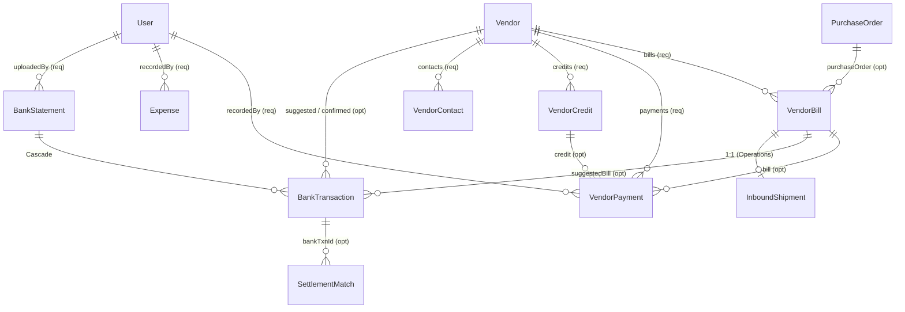
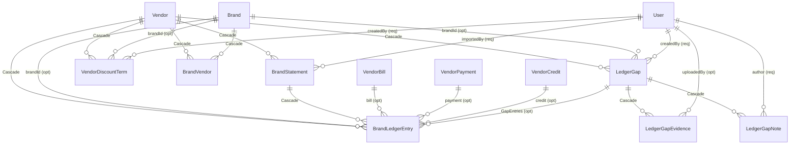
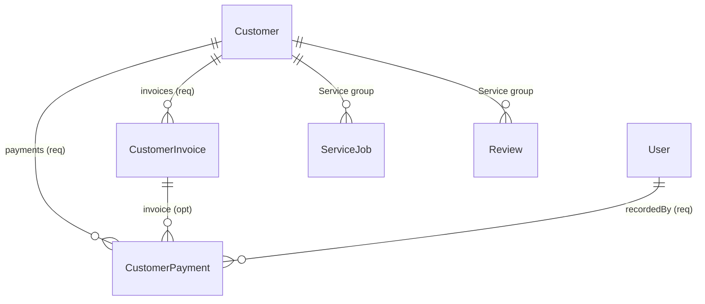

# Accounts group — schema map

Read [README.md](./README.md) first for the column conventions (`Nav`, implicit `onDelete`,
direct vs indirect).

Source: `prisma/schema.prisma`, `prisma/rbac-catalog.ts` (sortOrder band 250–349 = Accounts).

---

## 1. Modules in this group

| Module key | Label | Route | Tables it owns |
|---|---|---|---|
| `accounts` | Accounts | `/accounts` | `BankStatement`, `BankTransaction` |
| `bills` | Bills & Payments | *(null — hidden)* | `VendorBill`, `VendorPayment`, `VendorCredit` |
| `expenses` | Expenses | *(null — hidden)* | `Expense` |
| `cost_price` | Cost Price Visibility | *(null)* | **none** — a column-level grant, see §1.1 |
| `customers` | Customers & Receivables | `/receivables` | `Customer`, `CustomerInvoice`, `CustomerPayment` |
| `brand_ledger` | Brand Ledgers | `/ledger` | `BrandLedgerEntry`, `BrandStatement`, `VendorDiscountTerm`, `BrandVendor` |
| `brand_ledger_gaps` | Ledger Claims | *(null — lives inside a vendor's ledger)* | `LedgerGap`, `LedgerGapEvidence`, `LedgerGapNote` |

**16 tables owned.** `Vendor` is used by every module here but is owned by **Purchase**
(`vendors`, `/vendors`) — it is documented in §4 because the entire group hangs off it.

Four modules have `route: null`. That is deliberate: they are hidden from the sidebar but still
gate APIs and columns. Deleting them would revoke grants.

### 1.1 `cost_price` owns no table

`cost_price.view` is a grant over **money columns**, checked at four call sites:

| Checked in | Guards |
|---|---|
| `src/app/api/products/route.ts`, `…/products/[id]/route.ts` | `Product.costPrice` (stripped from the response without the grant) |
| `src/app/(dashboard)/stock/[id]/page.tsx`, `stock/by-brand/page.tsx` | cost columns in the stock UI |
| `src/app/(dashboard)/inbound/[id]/page.tsx` | `InboundLineItem.rate` / `.amount` / shipment total |
| `src/app/api/second-hand/route.ts`, `second-hand/page.tsx`, `second-hand/[id]/page.tsx` | `SecondHandCycle.costPrice` / `sellingPrice` |

Note the reach: three of the four are **Operations** tables. `cost_price` is an Accounts-group
permission applied to Operations data.

---

## 2. Table inventory

Postgres table names split here — **the ledger tables are snake_case, the rest are not.**

| Table | Postgres table | Grain (one row =) | Natural key / unique |
|---|---|---|---|
| `BankStatement` | `"BankStatement"` | one uploaded statement file | — |
| `BankTransaction` | `"BankTransaction"` | one line on a statement | — |
| `VendorBill` | `"VendorBill"` | one purchase invoice | `@@unique([vendorId, billNo])` |
| `VendorPayment` | `"VendorPayment"` | one payment out | — |
| `VendorCredit` | `"VendorCredit"` | one credit note | `@@unique([vendorId, creditNoteNo])` |
| `Expense` | `"Expense"` | one petty-cash spend | — |
| `Customer` | `"Customer"` | one person | `phone` unique |
| `CustomerInvoice` | `"CustomerInvoice"` | one sales invoice | `invoiceNo` unique |
| `CustomerPayment` | `"CustomerPayment"` | one payment in | — |
| `BrandLedgerEntry` | `brand_ledger_entries` | one row of **their** statement | — |
| `BrandStatement` | `brand_statements` | one statement import | — |
| `LedgerGap` | `ledger_gaps` | one unresolved money claim | `@@unique([vendorId, number])` |
| `LedgerGapEvidence` | `ledger_gap_evidence` | one uploaded proof | — |
| `LedgerGapNote` | `ledger_gap_notes` | one chase / reply | — |
| `VendorDiscountTerm` | `vendor_discount_terms` | one agreed discount rule | — |
| `BrandVendor` | `brand_vendors` | one brand↔vendor pairing | `@@unique([brandId, vendorId])` |

---

## 3. ER diagram — payables + reconciliation

## 4. ER diagram — brand ledger

`Vendor` is the anchor of this whole block. Everything cascades from it.

## 5. ER diagram — receivables

---

## 6. Relationship register — every FK inside Accounts

### 6.1 `bills`

| From → To | Card. | Nav | FK | onDelete |
|---|---|---|---|---|
| `VendorBill` → `Vendor` | N:1 | bidirectional | required | (implicit Restrict) |
| `VendorBill` → `PurchaseOrder` | N:1 | bidirectional | optional | (implicit SetNull) |
| `VendorPayment` → `Vendor` | N:1 | bidirectional | required | (implicit Restrict) |
| `VendorPayment` → `VendorBill` | N:1 | bidirectional | optional | (implicit SetNull) |
| `VendorPayment` → `VendorCredit` | N:1 | bidirectional | optional | (implicit SetNull) |
| `VendorPayment` → `User` *(PaymentRecordedBy)* | N:1 | bidirectional | required | (implicit Restrict) |
| `VendorCredit` → `Vendor` | N:1 | bidirectional | required | (implicit Restrict) |

`VendorPayment.billId` is **optional** on purpose — an on-account payment settles no single
bill. `VendorBill.paidAmount` is therefore a **cached total**, not a derived sum; nothing in the
database keeps it equal to `SUM(payments.amount)`.

### 6.2 `expenses`

| From → To | Card. | Nav | FK | onDelete |
|---|---|---|---|---|
| `Expense` → `User` *(ExpenseRecordedBy)* | N:1 | bidirectional | required | (implicit Restrict) |

That is the whole register. `Expense` has **one** FK. `paidBy` — the person the money actually
went to — is free text, not a `User`. And nothing points *at* `Expense`: see §8.1.

### 6.3 `accounts` (bank reconciliation)

| From → To | Card. | Nav | FK | onDelete |
|---|---|---|---|---|
| `BankStatement` → `User` *(StatementUploader)* | N:1 | bidirectional | required | (implicit Restrict) |
| `BankTransaction` → `BankStatement` | N:1 | bidirectional | required | **Cascade** |
| `BankTransaction` → `Vendor` *(SuggestedVendorTxn)* | N:1 | bidirectional | optional | (implicit SetNull) |
| `BankTransaction` → `VendorBill` *(SuggestedBillTxn)* | N:1 | bidirectional | optional | (implicit SetNull) |
| `BankTransaction` → `Vendor` *(ConfirmedVendorTxn)* | N:1 | bidirectional | optional | (implicit SetNull) |
| `BankTransaction.confirmedPaymentId` → `VendorPayment` | N:1 | **unidirectional (soft)** | — | **none** |
| `BankTransaction.confirmedExpenseId` → `Expense` | N:1 | **unidirectional (soft)** | — | **none** |

This table is the group's sharpest asymmetry. The three *AI-suggested* matches are real foreign
keys. The two *confirmed* matches — the ones that represent a human decision and are the reason
the row exists — are bare `String?` columns with no constraint. `src/app/api/bank-statements/[id]/review/route.ts`
writes real ids into them (lines 104, 154, 191); nothing stops those ids dangling.

### 6.4 `customers`

| From → To | Card. | Nav | FK | onDelete |
|---|---|---|---|---|
| `CustomerInvoice` → `Customer` | N:1 | bidirectional | required | (implicit Restrict) |
| `CustomerPayment` → `Customer` | N:1 | bidirectional | required | (implicit Restrict) |
| `CustomerPayment` → `CustomerInvoice` | N:1 | bidirectional | optional | (implicit SetNull) |
| `CustomerPayment` → `User` *(CustomerPaymentRecordedBy)* | N:1 | bidirectional | required | (implicit Restrict) |

`Customer.phone` is **required and unique**. Both matter: a nullable unique column in Postgres
still allows unlimited `NULL` rows, so `String?` would not have prevented duplicate walk-ins.

### 6.5 `brand_ledger`

| From → To | Card. | Nav | FK | onDelete |
|---|---|---|---|---|
| `BrandLedgerEntry` → `Vendor` | N:1 | bidirectional | required | **Cascade** |
| `BrandLedgerEntry` → `Brand` | N:1 | bidirectional | optional | (implicit SetNull) |
| `BrandLedgerEntry` → `BrandStatement` | N:1 | bidirectional | optional | **Cascade** |
| `BrandLedgerEntry` → `VendorBill` | N:1 | bidirectional | optional | (implicit SetNull) |
| `BrandLedgerEntry` → `VendorPayment` | N:1 | bidirectional | optional | (implicit SetNull) |
| `BrandLedgerEntry` → `VendorCredit` | N:1 | bidirectional | optional | (implicit SetNull) |
| `BrandLedgerEntry` → `LedgerGap` *(GapEntries)* | N:1 | bidirectional | optional | (implicit SetNull) |
| `BrandStatement` → `Vendor` | N:1 | bidirectional | required | **Cascade** |
| `BrandStatement` → `User` *(StatementImportedBy)* | N:1 | bidirectional | required | (implicit Restrict) |
| `VendorDiscountTerm` → `Vendor` | N:1 | bidirectional | required | **Cascade** |
| `VendorDiscountTerm` → `Brand` | N:1 | bidirectional | optional | (implicit SetNull) |
| `VendorDiscountTerm` → `User` *(DiscountTermCreatedBy)* | N:1 | bidirectional | required | (implicit Restrict) |
| `BrandVendor` → `Brand` | N:1 | bidirectional | required | **Cascade** |
| `BrandVendor` → `Vendor` | N:1 | bidirectional | required | **Cascade** |

`BrandLedgerEntry` is the widest table in the schema by relation count — **seven** outgoing FKs,
six of them optional. That shape is the design: a statement row arrives matched to nothing, and
each optional FK is a reconciliation decision made later.

`BrandVendor` materialises **Brand N:M Vendor** as an explicit join (rather than Prisma's
implicit `_BrandToVendor`) so the pairing can carry `isPrimary` and `note`. One distributor
supplies several brands; a brand can arrive through several vendors.

**Attached to `Vendor`, not `Brand`** — you pay the billing entity, and brand ≠ entity
(Raleigh is billed via Naren International; EMotorad via Inkodop Technologies).

### 6.6 `brand_ledger_gaps`

| From → To | Card. | Nav | FK | onDelete |
|---|---|---|---|---|
| `LedgerGap` → `Vendor` | N:1 | bidirectional | required | **Cascade** |
| `LedgerGap` → `Brand` | N:1 | bidirectional | optional | (implicit SetNull) |
| `LedgerGap` → `User` *(LedgerGapCreatedBy)* | N:1 | bidirectional | required | (implicit Restrict) |
| `LedgerGapEvidence` → `LedgerGap` | N:1 | bidirectional | required | **Cascade** |
| `LedgerGapEvidence` → `User` *(GapEvidenceUploadedBy)* | N:1 | bidirectional | optional | (implicit SetNull) |
| `LedgerGapNote` → `LedgerGap` | N:1 | bidirectional | required | **Cascade** |
| `LedgerGapNote` → `User` *(LedgerGapNoteAuthor)* | N:1 | bidirectional | required | (implicit Restrict) |

---

## 7. Cross-group edges

### 7.1 Direct — one FK hop out of Accounts

| Accounts table | → Target | Target group | Card. | FK |
|---|---|---|---|---|
| `VendorBill` | `Vendor` | **Purchase** | N:1 | required |
| `VendorBill` | `PurchaseOrder` | **Purchase** | N:1 | optional |
| `VendorPayment` | `Vendor` | **Purchase** | N:1 | required |
| `VendorCredit` | `Vendor` | **Purchase** | N:1 | required |
| `BankTransaction` | `Vendor` ×2 | **Purchase** | N:1 | optional |
| `BrandLedgerEntry` | `Vendor` / `Brand` | **Purchase** | N:1 | req / opt |
| `BrandStatement` | `Vendor` | **Purchase** | N:1 | required |
| `LedgerGap` | `Vendor` / `Brand` | **Purchase** | N:1 | req / opt |
| `VendorDiscountTerm` | `Vendor` / `Brand` | **Purchase** | N:1 | req / opt |
| `BrandVendor` | `Brand` + `Vendor` | **Purchase** | N:M join | required |
| *(7 columns across 7 tables)* | `User` | **Admin** | N:1 | mixed |

**Every single ledger table points at `Vendor`.** Accounts has no self-contained subtree — it is
structurally a satellite of Purchase's `Vendor`.

### 7.2 Direct — one FK hop *into* Accounts from elsewhere

| Source table | Source group | → Accounts table | Card. | FK |
|---|---|---|---|---|
| `InboundShipment` | **Operations** | `VendorBill` | 1:1 | optional, `@unique` |
| `SettlementMatch` | **Operations** | `BankTransaction` | N:1 | optional |
| `VendorIssue` | **Purchase** | `VendorBill` | N:1 | optional |
| `ServiceJob` | **Service** | `Customer` | N:1 | **required** |
| `Review` | **Service** | `Customer` | N:1 | **required** |

### 7.3 Indirect reach — paths, not edges

| Accounts → | Path | Hops |
|---|---|---|
| **Operations** (`Product`) | `VendorBill → PurchaseOrder → PurchaseOrderItem → Product` | 3 |
| **Operations** (`Product`) | `VendorBill → InboundShipment → InboundLineItem → Product` | 3 |
| **Operations** (`StockLevel`) | `VendorBill → PurchaseOrder → PurchaseOrderItem → Product → StockLevel` | 4 |
| **Operations** (`PosSession`) | `BankTransaction → SettlementMatch → DailySettlement → PosSession` | 3 |
| **Operations** (`Product`) | `Vendor → Product (reorderVendor)` | 1 hop from the shared anchor |
| **Purchase** (`VendorIssue`) | `VendorBill → VendorIssue` | 1 |
| **Purchase** (`VendorContact`) | `VendorBill → Vendor → VendorContact` | 2 |
| **Service** (`ServiceJob`) | `Customer → ServiceJob` | 1 |
| **Service** (`Review`) | `Customer → ServiceJob → Review` | 2 |
| **Admin** (`Store`) | `…RecordedById → User → Store` | 2 |
| **Insights** / **Staff LMS** | **unreachable by FK** | ∞ |

Two structural facts:

1. **`Customer` is the only bridge from Accounts to Service.** `ServiceJob.customerId` and
   `Review.customerId` are both **required** — the workshop cannot create a job without an
   Accounts-group `Customer` row. That is the tightest cross-group coupling in the application.
2. **Accounts reaches physical stock only through Purchase or Inbound**, never directly. There
   is no FK from any Accounts table to `Product`, `StockLevel` or `Bin`.

---

## 8. Soft links — no FK, nothing enforced

### 8.1 Dangling id columns

| Column | Really points at | Consequence |
|---|---|---|
| `BankTransaction.confirmedPaymentId` | `VendorPayment.id` | Deleting a payment leaves the bank line marked `MATCHED` and pointing at nothing. |
| `BankTransaction.confirmedExpenseId` | `Expense.id` | Same. **Nothing at all points at `Expense` by FK** — it is reachable only through this unconstrained string. |
| `BankTransaction.suggestedCategory` | `ExpenseCategory` enum | Stored as `String?`. A value that is not a valid enum member can be written and will fail only when someone tries to create the expense. |
| `SyncLog.triggeredBy` | `User.id` | plain `String?` |
| `ZohoPullPreview.reviewedById` | `User.id` | plain `String?` |

### 8.2 Value-matched links

| Column | Really points at | Note |
|---|---|---|
| `Customer.phone` | `Delivery.customerPhone`, `SecondHandCycle.customerPhone`, `PreBooking.customerPhone`, `InboundLineItem.preBookedCustomerPhone`, `NotificationLog.customerPhone` | The identity join for the whole app — and **not once enforced.** Five Operations/Service columns match on it by string. |
| `CustomerInvoice.invoiceNo` | `Delivery.invoiceNo` | Both unique in their own table, never joined. A sale exists twice with no link. |
| `VendorBill.billNo` | `InboundShipment.billNo` | The shipment *also* has a real `vendorBillId` FK. Both can be set and disagree. |
| `VendorBill.billedTo` | `"HUB"` / `"CENTRE"` | Free text. This is the EMotorad two-folio problem the ledger module exists to solve, still modelled as a string. |
| `BrandLedgerEntry.ref` | the brand's own voucher number | Intentionally unconstrained — it is *their* number, transcribed. |
| `Expense.paidBy` | a person | Free text, not `User`. |
| `LedgerGap.promisedBy`, `VendorDiscountTerm.agreedBy` | someone at the brand | Free text by design — an empty value **is** the signal that a term is unproven. |

### 8.3 Duplicated / dead columns

| Where | Issue |
|---|---|
| `Vendor.cdTermsDays`, `Vendor.cdPercentage` | Models only a **cash** discount. Superseded in expressiveness by `VendorDiscountTerm`, but still the column all ~50 cash-discount call sites in `src/` read. Both live; neither is authoritative. |
| `Brand.cdTermsDays`, `Brand.cdPercentage` | **Dead.** The schema comment says so outright — every discount usage reads `Vendor`, not `Brand`. Slated for removal. |
| `VendorBill.paidAmount`, `VendorCredit.usedAmount` | Cached running totals with no database-side guarantee against their child rows. |
| `BrandStatement.claimedClosing` vs `computedClosing` | Deliberately **both** stored. A mismatch (`tiesOut = false`) is the finding, not an error to correct. |

### 8.4 The rule the ledger module is built on

An import **never** edits the brand's numbers and **never** writes into BCH's books:

| Side | Tables |
|---|---|
| What the **brand** says | `BrandLedgerEntry`, `BrandStatement` |
| What **BCH's books** say | `VendorBill`, `VendorPayment`, `VendorCredit` |
| The **difference** worth chasing | `LedgerGap` + evidence + notes |

The optional FKs from `BrandLedgerEntry` to the three BCH tables are the *only* connection, and
they are set by a reconciliation decision — never by an import. Letting an import create a
`VendorBill` would turn the brand's mistake into BCH's accounting record.

---

## 9. Delete safety

| Delete this | Result |
|---|---|
| `Vendor` | **Blocked** by `VendorBill`, `VendorPayment`, `VendorCredit`, `VendorContact`, `PurchaseOrder` (implicit Restrict). If it were not blocked, it would **Cascade** away `BrandLedgerEntry`, `BrandStatement`, `LedgerGap`, `VendorDiscountTerm`, `BrandVendor` — five tables and the entire claim register. |
| `VendorBill` | **Blocked** by `VendorPayment`? No — that FK is optional, so payments are **orphaned** (`billId` → `NULL`). Also nulls `VendorIssue.billId`, `BankTransaction.suggestedBillId`, `InboundShipment.vendorBillId`, `BrandLedgerEntry.billId`. **Deleting a bill silently detaches its payments and its shipment.** |
| `VendorPayment` | Nulls `BrandLedgerEntry.paymentId`. Leaves `BankTransaction.confirmedPaymentId` **dangling** (no FK). |
| `VendorCredit` | Nulls `VendorPayment.creditId` and `BrandLedgerEntry.creditId`. |
| `Expense` | Nothing cascades. Leaves `BankTransaction.confirmedExpenseId` **dangling** (no FK). |
| `BankStatement` | **Cascades** to every `BankTransaction`. Those cascades then null `SettlementMatch.bankTxnId` — a POS settlement silently loses its bank evidence when someone deletes a statement upload. |
| `Customer` | **Blocked** by `CustomerInvoice`, `CustomerPayment`, `ServiceJob`, `Review` — all required. A customer with any history cannot be deleted. |
| `CustomerInvoice` | Nulls `CustomerPayment.invoiceId`. The payment survives, unallocated. |
| `BrandStatement` | **Cascades** to its `BrandLedgerEntry` rows. This is how a re-import supersedes an older statement. |
| `LedgerGap` | **Cascades** to `LedgerGapEvidence` and `LedgerGapNote`. Nulls `BrandLedgerEntry.gapId`. |
| `Brand` | Nulls `BrandLedgerEntry.brandId`, `LedgerGap.brandId`, `VendorDiscountTerm.brandId`; **Cascades** `BrandVendor`. But blocked upstream by `Product.brandId` and `InboundShipment.brandId` (both required). |
| `User` | **Blocked** by `VendorPayment.recordedBy`, `Expense.recordedBy`, `CustomerPayment.recordedBy`, `BankStatement.uploadedBy`, `BrandStatement.importedBy`, `LedgerGap.createdBy`, `LedgerGapNote.author`, `VendorDiscountTerm.createdBy`. Hence `/team` deactivates. |

### The two that should worry you

1. **`BankStatement` → Cascade → `BankTransaction` → SetNull → `SettlementMatch.bankTxnId`.**
   Re-uploading a corrected statement wipes the bank side of every POS settlement match it
   touched, leaving `SettlementMatch.isMatched = true` with no transaction behind it.
2. **Deleting a `VendorBill` orphans its payments** rather than blocking. `VendorPayment.billId`
   is optional (correct — on-account payments exist), so the delete succeeds and the money is
   still recorded against the vendor but no longer against any bill.
