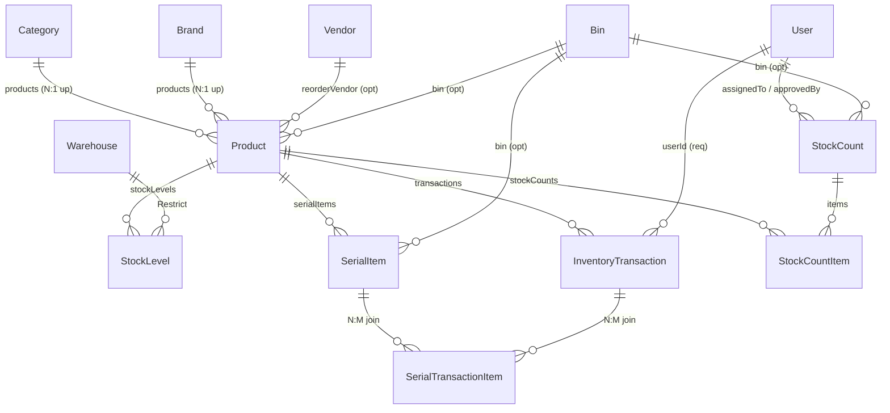
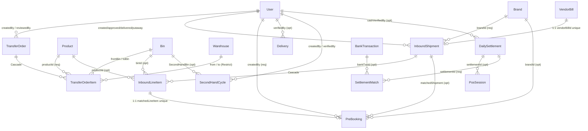

# Operations group — schema map

Read [README.md](./README.md) first for the column conventions (`Nav`, implicit `onDelete`,
direct vs indirect).

Source: `prisma/schema.prisma`, `prisma/rbac-catalog.ts` (sortOrder band 100–199 = Operations).

---

## 1. Modules in this group

| Module key | Label | Route | Tables it owns |
|---|---|---|---|
| `stock` | Stock & Inventory | `/stock` | `Product`, `StockLevel`, `SerialItem`, `SerialTransactionItem`, `Bin`, `InventoryTransaction` |
| `inbound` | Inbound Tracking | `/inbound` | `InboundShipment`, `InboundLineItem`, `PreBooking` |
| `deliveries` | Deliveries & Dispatch | `/deliveries` | `Delivery`, `AlertConfig` |
| `transfers` | Stock Transfers | `/transfers` | `TransferOrder`, `TransferOrderItem` |
| `stock_audit` | Stock Audit / Count | `/stock-audit` | `StockCount`, `StockCountItem` |
| `second_hand` | Second-Hand Cycles | `/second-hand` | `SecondHandCycle` |
| `barcode` | Barcode & Labels | `/scanner` | **none** — reads/writes `SerialItem.barcodeData` + `barcodeFormat` |
| `pos` | POS & Settlement | `/accounts/settlement` | `PosSession`, `DailySettlement`, `SettlementMatch` |

**19 tables owned.** Two module-level oddities worth knowing:

- `barcode` is a **permission over columns**, not over a table. It gates label printing and
  scanner writes against `SerialItem`, which `stock` owns.
- `pos` sits in the **Operations** group but its route is `/accounts/settlement` and its tables
  join to `BankTransaction` in Accounts. It is the single biggest Operations↔Accounts seam —
  see §6.

---

## 2. Table inventory

All 19 tables have **no `@@map`** — the Postgres table is the PascalCase model name and must be
quoted: `select * from "StockLevel";`

| Table | Grain (one row =) | Natural key / unique |
|---|---|---|
| `Product` | one SKU | `sku` unique, `zohoItemId` unique |
| `StockLevel` | one (product, warehouse) pair | `@@unique([productId, warehouseId])` |
| `SerialItem` | one physical unit | `serialCode` unique (`{SKU}-{seq}`) |
| `SerialTransactionItem` | one serial touched by one transaction | *(none — see §7)* |
| `Bin` | one shelf location | `code` unique (`A-01-03`) |
| `InventoryTransaction` | one stock movement | — (append-only ledger) |
| `StockCount` | one audit sheet | `countNo` unique (`SC-YYYYMM-NNNN`) |
| `StockCountItem` | one line on a sheet | — |
| `TransferOrder` | one transfer request | `orderNo` unique (`TRF-YYYYMM-NNNN`) |
| `TransferOrderItem` | one line on a transfer | — |
| `InboundShipment` | one brand delivery | `shipmentNo` unique (`IB-YYYYMM-0001`), `vendorBillId` unique |
| `InboundLineItem` | one line on a bill photo | — |
| `PreBooking` | one customer waiting for stock | `matchedLineItemId` unique |
| `Delivery` | one outbound invoice | `invoiceNo` unique, `selfFillToken` unique |
| `AlertConfig` | **singleton** (`id = "singleton"`) | — |
| `SecondHandCycle` | one traded-in cycle | `sku` unique (`SH-0001`) |
| `PosSession` | one Zakya till session | `zakyaSessionId` unique |
| `DailySettlement` | one calendar day | `date` unique |
| `SettlementMatch` | one expected amount vs one bank line | — |

---

## 3. ER diagram — stock core

## 4. ER diagram — movement (transfers, inbound, delivery, second-hand, POS)

`Delivery` and `AlertConfig` carry almost no edges — that is deliberate and it is explained in §7.

---

## 5. Relationship register — every FK inside Operations

Direction is **FK-holder → target**. `(implicit …)` means the schema declares no `onDelete`
and Prisma's default applies.

### 5.1 `stock`

| From → To | Card. | Nav | FK | onDelete |
|---|---|---|---|---|
| `Product` → `Category` | N:1 | bidirectional | required | (implicit Restrict) |
| `Product` → `Brand` | N:1 | bidirectional | required | (implicit Restrict) |
| `Product` → `Bin` | N:1 | bidirectional | optional | (implicit SetNull) |
| `Product` → `Vendor` *(ReorderVendor)* | N:1 | bidirectional | optional | (implicit SetNull) |
| `StockLevel` → `Product` | N:1 | bidirectional | required | (implicit Restrict) |
| `StockLevel` → `Warehouse` | N:1 | bidirectional | required | **Restrict** (explicit) |
| `SerialItem` → `Product` | N:1 | bidirectional | required | (implicit Restrict) |
| `SerialItem` → `Bin` | N:1 | bidirectional | optional | (implicit SetNull) |
| `SerialTransactionItem` → `SerialItem` | N:1 | bidirectional | required | (implicit Restrict) |
| `SerialTransactionItem` → `InventoryTransaction` | N:1 | bidirectional | required | (implicit Restrict) |
| `InventoryTransaction` → `Product` | N:1 | bidirectional | required | (implicit Restrict) |
| `InventoryTransaction` → `User` | N:1 | bidirectional | required | (implicit Restrict) |

`SerialItem` ↔ `InventoryTransaction` is an **N:M** materialised through
`SerialTransactionItem`. The join is explicit rather than Prisma-implicit, which is right —
but it carries **no `@@unique([serialItemId, transactionId])`**, so the same serial can be
attached to the same transaction twice. See §7.

`Bin` holds **no outgoing FK at all**. Seven tables point *into* it (`Product`, `SerialItem`,
`StockCount`, `TransferOrderItem` ×2, `SecondHandCycle`, `InboundLineItem`) and it points at
nothing. Its `location` column is a free `String` ("Store"/"Warehouse"), **not** a `Warehouse`
FK — see §7.

### 5.2 `stock_audit`

| From → To | Card. | Nav | FK | onDelete |
|---|---|---|---|---|
| `StockCount` → `User` *(assignedTo)* | N:1 | bidirectional | required | (implicit Restrict) |
| `StockCount` → `User` *(StockCountApprovedBy)* | N:1 | bidirectional | optional | (implicit SetNull) |
| `StockCount` → `Bin` | N:1 | bidirectional | optional | (implicit SetNull) |
| `StockCountItem` → `StockCount` | N:1 | bidirectional | required | (implicit Restrict) |
| `StockCountItem` → `Product` | N:1 | bidirectional | required | (implicit Restrict) |

`StockCountItem → StockCount` is **not** `Cascade`, unlike the equivalent line-item relation on
`TransferOrder` and `InboundShipment`. Deleting a `StockCount` fails while its items exist.
That is a safe default, but it is an inconsistency with its two siblings.

### 5.3 `transfers`

| From → To | Card. | Nav | FK | onDelete |
|---|---|---|---|---|
| `TransferOrder` → `User` *(TransferCreatedBy)* | N:1 | bidirectional | required | (implicit Restrict) |
| `TransferOrder` → `User` *(TransferReviewedBy)* | N:1 | bidirectional | optional | (implicit SetNull) |
| `TransferOrderItem` → `TransferOrder` | N:1 | bidirectional | required | **Cascade** |
| `TransferOrderItem` → `Product` | N:1 | bidirectional | required | (implicit Restrict) |
| `TransferOrderItem` → `Bin` *(TransferFromBin)* | N:1 | bidirectional | optional | (implicit SetNull) |
| `TransferOrderItem` → `Bin` *(TransferToBin)* | N:1 | bidirectional | optional | (implicit SetNull) |
| `TransferOrderItem` → `Warehouse` *(TransferFromWarehouse)* | N:1 | bidirectional | optional | **Restrict** |
| `TransferOrderItem` → `Warehouse` *(TransferToWarehouse)* | N:1 | bidirectional | optional | **Restrict** |

Two transfer *modes* coexist in one table: **bin mode** (dormant) sets `fromBinId`/`toBinId`;
**location mode** (active) sets `fromWarehouseId`/`toWarehouseId`. All four are nullable and
nothing in the schema enforces "exactly one pair is set".

### 5.4 `inbound`

| From → To | Card. | Nav | FK | onDelete |
|---|---|---|---|---|
| `InboundShipment` → `Brand` | N:1 | bidirectional | required | (implicit Restrict) |
| `InboundShipment` → `VendorBill` | **1:1** | bidirectional | optional, `@unique` | (implicit SetNull) |
| `InboundShipment` → `User` *(InboundCreatedBy)* | N:1 | bidirectional | required | (implicit Restrict) |
| `InboundShipment` → `User` *(InboundApprovedBy)* | N:1 | bidirectional | optional | (implicit SetNull) |
| `InboundShipment` → `User` *(InboundDeliveredBy)* | N:1 | bidirectional | optional | (implicit SetNull) |
| `InboundShipment` → `User` *(InboundPutawayBy)* | N:1 | bidirectional | optional | (implicit SetNull) |
| `InboundLineItem` → `InboundShipment` | N:1 | bidirectional | required | **Cascade** |
| `InboundLineItem` → `Product` | N:1 | bidirectional | optional | (implicit SetNull) |
| `InboundLineItem` → `Bin` | N:1 | bidirectional | optional | (implicit SetNull) |
| `PreBooking` → `Brand` | N:1 | bidirectional | optional | (implicit SetNull) |
| `PreBooking` → `InboundShipment` | N:1 | bidirectional | optional | (implicit SetNull) |
| `PreBooking` → `InboundLineItem` | **1:1** | bidirectional | optional, `@unique` | (implicit SetNull) |
| `PreBooking` → `User` *(PreBookingCreatedBy)* | N:1 | bidirectional | required | (implicit Restrict) |

`InboundLineItem.productId` being **optional** is the design point of this module: a line is
transcribed from a photo of a paper bill *before* anyone knows which SKU it is. The line exists
unmatched, and matching is a later human step.

The `InboundShipment → VendorBill` 1:1 is the **only enforced FK from Operations into Accounts.**

### 5.5 `deliveries`

| From → To | Card. | Nav | FK | onDelete |
|---|---|---|---|---|
| `Delivery` → `User` *(DeliveryVerifiedBy)* | N:1 | bidirectional | optional | (implicit SetNull) |
| `AlertConfig` | — | **no relations** | — | — |

That is the complete list. `Delivery` has **one** foreign key. Everything else about a delivery
— the customer, the products, the invoice, who resolved a flag — is stored as loose strings and
JSON. See §7; this is the largest soft-link surface in the application.

### 5.6 `second_hand`

| From → To | Card. | Nav | FK | onDelete |
|---|---|---|---|---|
| `SecondHandCycle` → `Bin` *(SecondHandBin)* | N:1 | bidirectional | optional | (implicit SetNull) |
| `SecondHandCycle` → `User` *(SecondHandCreatedBy)* | N:1 | bidirectional | required | (implicit Restrict) |
| `SecondHandCycle` → `User` *(SecondHandVerifiedBy)* | N:1 | bidirectional | optional | (implicit SetNull) |

A second-hand cycle is **not** a `Product` row. It has its own `sku` (`SH-0001`), its own
`costPrice`/`sellingPrice`, and no `StockLevel`. It never enters `InventoryTransaction`.

### 5.7 `pos`

| From → To | Card. | Nav | FK | onDelete |
|---|---|---|---|---|
| `PosSession` → `DailySettlement` | N:1 | bidirectional | optional | (implicit SetNull) |
| `DailySettlement` → `User` *(SettlementCashVerifier)* | N:1 | bidirectional | optional | (implicit SetNull) |
| `SettlementMatch` → `DailySettlement` | N:1 | bidirectional | required | (implicit Restrict) |
| `SettlementMatch` → `BankTransaction` | N:1 | bidirectional | optional | (implicit SetNull) |

---

## 6. Cross-group edges

### 6.1 Direct — one FK hop out of Operations

| Operations table | → Target | Target group | Card. | FK | Meaning |
|---|---|---|---|---|---|
| `InboundShipment` | `VendorBill` | **Accounts** | 1:1 | optional | the brand delivery *is* this bill |
| `SettlementMatch` | `BankTransaction` | **Accounts** | N:1 | optional | expected POS amount matched to a bank line |
| `Product` | `Vendor` | **Purchase** | N:1 | optional | reorder-from vendor |
| `Product` | `Brand` | **Purchase** | N:1 | required | — |
| `Product` | `Category` | **Purchase** | N:1 | required | — |
| `InboundShipment` | `Brand` | **Purchase** | N:1 | required | — |
| `PreBooking` | `Brand` | **Purchase** | N:1 | optional | — |
| `StockLevel` | `Warehouse` | **Admin** | N:1 | required | where the stock physically is |
| `TransferOrderItem` | `Warehouse` ×2 | **Admin** | N:1 | optional | — |
| *(15 columns across 9 tables)* | `User` | **Admin** | N:1 | mixed | every `createdBy`/`approvedBy`/`verifiedBy` |

### 6.2 Direct — one FK hop *into* Operations from elsewhere

| Source table | Source group | → Operations table | Card. |
|---|---|---|---|
| `PurchaseOrderItem` | Purchase | `Product` | N:1 required |
| `BrandStockItem` | Purchase (`reorder`) | `Product` | N:1 optional |
| `BrandSkuMapping` | Purchase (`reorder`) | `Product` | N:1 required |
| `LmsProduct` | Staff LMS | `Product` *(stockProductId)* | N:1 optional, **SetNull** |

### 6.3 Indirect reach — paths, not edges

| Operations → | Path | Hops |
|---|---|---|
| **Accounts** (`VendorBill`) | `Product → PurchaseOrderItem → PurchaseOrder → VendorBill` | 3 |
| **Accounts** (`VendorBill`) | `Product → Vendor(reorder) → VendorBill` | 2 |
| **Accounts** (`BankStatement`) | `PosSession → DailySettlement → SettlementMatch → BankTransaction → BankStatement` | 4 |
| **Accounts** (`BrandLedgerEntry`) | `InboundShipment → VendorBill → BrandLedgerEntry` | 2 |
| **Accounts** (`LedgerGap`) | `InboundShipment → VendorBill → Vendor → LedgerGap` | 3 |
| **Accounts** (`VendorPayment`) | `InboundShipment → VendorBill → VendorPayment` | 2 |
| **Admin** (`Store`) | `StockLevel → Warehouse → Store` | 2 |
| **Admin** (`Role`) | *any* `…ById → User → Role` | 2 |
| **Purchase** (`VendorContact`) | `Product → Vendor → VendorContact` | 2 |
| **Purchase** (`VendorIssue`) | `InboundShipment → VendorBill → VendorIssue` | 2 |
| **Service** | **unreachable by FK** — no path exists (see §7) | ∞ |

Two things fall out of this table:

1. **Operations reaches Accounts almost entirely through `VendorBill`.** Of six paths to
   Accounts, four go through that one table. `VendorBill` is the hinge between what arrived and
   what is owed.
2. **Operations and Service are disconnected in the schema.** There is no FK path from any
   Operations table to `ServiceJob`, `Review` or `AssemblyLog`. They meet only at `Customer`
   (Accounts) and through untyped strings.

---

## 7. Soft links — no FK, nothing enforced

These joins are made in application code by matching values. Postgres does not check them,
`onDelete` does not apply, and a rename or delete on either side breaks them silently.

### 7.1 `Delivery` — the biggest gap

`Delivery` holds **one** FK (`verifiedById`). Everything else is denormalised text:

| Column | Really points at | Group | Risk |
|---|---|---|---|
| `customerName`, `customerPhone`, `alternatePhone`, `customerAddress` | `Customer` | Accounts | A delivery never resolves to a customer row. The same person is retyped per invoice; `Customer.phone` is unique but nothing joins to it. |
| `lineItems` (`Json`) | `Product` | Operations | Sold products are a JSON blob. No stock relation, no `Product` FK, unqueryable by SKU without JSON operators. |
| `invoiceNo`, `zohoInvoiceId` | Zoho Books | external | The real identity of the record. `invoiceNo` is unique here, which is the only guard. |
| `flagResolvedBy` | `User.id` | Admin | Plain `String?`. `verifiedById` beside it *is* a real FK — the two are inconsistent. |
| `salesPerson` | `User.name` | Admin | Free text, not an id. |
| `invoiceType` (`"SALES"`/`"SERVICE"`) | the Service group | Service | The only marker tying a delivery to workshop work. Untyped, nullable. |

### 7.2 Everything else

| Column | Really points at | Note |
|---|---|---|
| `SecondHandCycle.customerPhone`, `soldToPhone` | `Customer.phone` | Trade-in and buyer are both text. |
| `SecondHandCycle.zohoInvoiceNo`, `zohoItemId`, `soldInvoiceNo` | Zoho | external ids |
| `InboundLineItem.sku` | `Product.sku` | Sits *beside* the real `productId` FK. Both can be set and disagree. |
| `InboundLineItem.preBookedCustomerName/Phone` | `Customer` | Duplicates what `PreBooking` models properly one table over. |
| `PreBooking.customerName`, `customerPhone` | `Customer` | No FK, though `PreBooking` has four real FKs. |
| `PreBooking.zohoInvoiceNo` | `Delivery.invoiceNo` / Zoho | The natural join to `Delivery` — unenforced. |
| `PreBooking.salesPerson` | `User.name` | free text |
| `InventoryTransaction.referenceNo` | PO number / invoice number | Polymorphic by design; nothing to constrain it to. |
| `StockCount.location` | `Warehouse.code` | Legacy `"BCH-GF"`/`"BCH-FF"` strings. `StockCount` has no `Warehouse` FK. |
| `StockCount.productType` | `ProductType` enum | Stored as `String?`, not the enum. |
| `Bin.location` | `Warehouse` | `"Store"` / `"Warehouse"` free text. **Bins are not attached to a warehouse.** |
| `Product.zohoItemId` | Zoho Books item | unique, external |
| `PosSession.zakyaSessionId` | Zakya POS | unique, external — the idempotency key for the pull |
| `PosSession.rawData` (`Json`) | full Zakya response | kept for replay |

### 7.3 Missing constraints

| Table | What is missing | Consequence |
|---|---|---|
| `SerialTransactionItem` | `@@unique([serialItemId, transactionId])` | The same serial can be attached to one transaction more than once. |
| `TransferOrderItem` | a check that exactly one of (bin pair / warehouse pair) is set | A row can name both, or neither. |
| `Product.currentStock` | — | A **cached** `SUM` of `StockLevel.quantity`, recomputed in `src/lib/stock-location.ts`. Not enforced by the database; drift is possible and invisible. |

---

## 8. Delete safety

What happens when you delete a parent row.

| Delete this | Result |
|---|---|
| `Product` | **Blocked** by `StockLevel`, `SerialItem`, `InventoryTransaction`, `StockCountItem`, `PurchaseOrderItem`, `TransferOrderItem` (all implicit Restrict). Nulls out `InboundLineItem.productId`, `BrandStockItem.productId`, `LmsProduct.stockProductId`. |
| `Bin` | **Never blocked.** All seven inbound FKs are optional → every one is set to `NULL`. Products, serials and second-hand cycles silently lose their location. |
| `Warehouse` | **Blocked** by `StockLevel` and by `TransferOrderItem` (both explicit `Restrict`). |
| `Store` | **Blocked** by its `Warehouse` rows. Staff are *unassigned* (`User.storeId` → `SetNull`), not blocked. |
| `TransferOrder` | **Cascades** to `TransferOrderItem`. |
| `InboundShipment` | **Cascades** to `InboundLineItem`. `PreBooking.matchedShipmentId` → `NULL`. |
| `StockCount` | **Blocked** by `StockCountItem` — inconsistent with the two rows above. |
| `VendorBill` | `InboundShipment.vendorBillId` → `NULL`. The shipment survives, orphaned from its bill. |
| `DailySettlement` | **Blocked** by `SettlementMatch`. `PosSession.settlementId` → `NULL`. |
| `BankTransaction` | `SettlementMatch.bankTxnId` → `NULL`. The match row survives with `isMatched = true` and no transaction. |
| `User` | **Blocked** by any required `…ById` — `InventoryTransaction`, `StockCount.assignedTo`, `TransferOrder.createdBy`, `InboundShipment.createdBy`, `PreBooking.createdBy`, `SecondHandCycle.createdBy`. This is why `/team` deactivates rather than deletes. |
| `Delivery` | Nothing to cascade. Fully self-contained. |
